# Design Resource Reference

Verified reference for every visual-resource site shipped in the Open Design **Design Browser** panel
(`apps/web/src/components/DesignBrowserPanel.tsx`) — **80 sites across 14 categories**.

Each entry answers the one question that actually blocks work: **what can I use for free, what does a
subscription buy me, and can I legally ship it?**

- **Researched:** 21 August 2026 · five parallel research agents, primary sources (each site's own
  `/pricing`, `/license`, `/terms`) preferred over third-party summaries.
- **Screenshots:** 105 images in [`shots/`](shots/), captured 21 August 2026 at 1440×900, JPEG q82.
  Provenance (source URL, HTTP status, final URL after redirects) is in
  [`capture-manifest.json`](capture-manifest.json).
- **Honesty rule:** anything that could not be confirmed against a primary source is marked
  **`unverified`** rather than guessed. Prices move — re-check before you budget against them.

---

## 1. The subscription question, answered

### Free forever — no wall, no attribution, safe to ship

No account needed, no paid tier that matters, permissive license.

| Resource | Category | License |
|---|---|---|
| Google Fonts | Type | OFL 1.1 / Apache-2.0 |
| Fontshare | Type | OFL 1.1 / ITF Free Font License |
| Lucide | Icons | ISC |
| Heroicons | Icons | MIT |
| Iconify | Icons | Varies per set (MIT / Apache / CC0 / CC-BY) |
| Lobe Icons | Icons | MIT (code) + brand trademarks |
| unDraw | Illustration | Open license, **no attribution** |
| Pexels | Photography | Pexels License, no attribution |
| Pixabay | Photography | Pixabay Content License, no attribution |
| Unsplash | Photography | Unsplash License, no attribution |
| GSAP | Motion | Free since Webflow acquisition — all plugins |
| React Bits | Motion | MIT + Commons Clause |
| Three.js | 3D | MIT |
| Realtime Colors | Color | Free forever, exports included |
| Color Hunt · Happy Hues | Color | Free (license text `unverified`) |
| Radix UI · Base UI · Headless UI · shadcn/ui | Components | MIT |
| React Aria | Components | Apache-2.0 |
| Mantine · Ant Design | Components | MIT |
| Laws of UX | Guidelines | CC BY-NC-ND (**non-commercial only**) |
| The A11y Project | Guidelines | Apache-2.0 |
| Material Design 3 | Guidelines | Apache-2.0 / MIT / BSD-3 per platform |
| Impeccable Style | Systems | Apache-2.0 |
| Taste Skill | Tools | MIT |

### Free tier exists, but you *will* hit the wall

| Resource | The wall you hit | Cost to remove it |
|---|---|---|
| **Coolors** | 10 saved palettes, 1 project, max 5 colors | **$3/mo** |
| **Land-book** | 3 boards, limited filters/search | **$9/mo** ($6/mo yearly) |
| **Mobbin** | Only recent apps, ~3 collections | ~**$20–40/seat/mo** `unverified` |
| **Fontpair** | Export limits, 500+ pairings locked | **$8/mo** ($4/mo yearly) |
| **Transitions.dev** | CSS-only snippets; no React/TS variants | **$9/mo** or **$149 lifetime** |
| **Storyset** | **Attribution mandatory** on free tier | Freepik premium, price `unverified` |
| **Blush** | PNG only, limited collections, no SVG | **$12/mo** / $96/yr `unverified` |
| **Lummi** | Watermarks on Pro-flagged images | **$15/mo** ($10/mo yearly) |
| **Spline** | Watermarked web exports, file cap | **$12/mo** yearly |
| **Womp** | 4K export capped, materials locked | **$9.99/mo** yearly |
| **Mockuuups** | Small free subset only | **$15/mo** or $120/yr |
| **Angle** | Free tier is **personal use only** | **$79** (1 yr) / **$149** lifetime |
| **Shots** | WebP + premium effects locked | ~$8–12/mo `unverified` |
| **Unsplash+** | Exclusive curated collection | ~$7–20/mo `unverified` |
| **Brandfetch** | 100 free Brand API calls | **$99/mo** |
| **MUI X** | Data Grid / Charts / Pickers Pro features | **$299–1,399/yr per dev** |
| **Chakra UI Pro** | 330+ prebuilt page blocks | **$299** / $899 one-time |
| **Ark Plus** | Production-ready recipes | **$199** / $599 one-time |
| **HeroUI Pro** | Premium templates & blocks | one-time, price `unverified` |
| **daisyUI store** | Page templates, Figma library | **$19–69** per template |
| **Dribbble Pro** | *Seller-side only* — browsing stays free | $4–99/mo |
| **Behance Pro** | *Seller-side only* — browsing stays free | ~$9.99/mo `unverified` |
| **Awwwards** | *Submission-side only* — browsing stays free | ~$55–65 per submission |

### No free tier at all

| Resource | Cost | Note |
|---|---|---|
| **Page Flows** | $8.25–13/mo | "Trial" is a **paid, non-refundable $2.95** — not a free trial |
| **Animations.dev** | **$199** one-time | 2 free preview lessons only; enrollment opens in windows |
| **Rotato** | one-time, tiers `unverified` | Mac app, no free tier |
| **Motion Sites** | $149/yr or $239 one-time | Free prompts are a limited subset |
| **Motion.page** | ~€119/yr | 7-day trial only |
| **Typewolf** | $399 one-time *(course)* | The **site itself is free** — only the course is paid |
| **Animography** | ~$120 per typeface `unverified` | A few free fonts; not a subscription |
| **GetDesign** | $39 / $249 one-time | 300+ public DESIGN.md files are free to browse |

---

## 2. Licensing traps worth knowing before you ship

1. **Inspiration galleries grant you nothing.** Dribbble, Behance, Awwwards, Godly, Land-book, Cosmos,
   Mobbin, Page Flows and Fonts In Use all display **third-party work whose creators keep every right**.
   They are for looking at, not for lifting. Cosmos is the sharpest trap — it aggregates images from
   across the web, so nothing there is pre-cleared.
2. **Brand-logo sets are MIT *code* wrapping non-MIT *trademarks*.** The SVG, SVG Logos and Lobe Icons
   are all MIT-licensed packages; the marks inside remain the property of Apple, OpenAI, Google et al.
   Nominative fair use (integration badges, comparison tables, "Sign in with…") is fine. Merch is not.
3. **Pixabay's API rules contradict its download rules.** Manual downloads need no attribution; the API
   *requires* attribution, mandates 24-hour caching, forbids hotlinking, and caps you at 100 req/60s.
   Full-resolution URLs need separate approval.
4. **Laws of UX is CC BY-NC-ND.** Genuinely free, genuinely **non-commercial** — it cannot go into a
   client deck, a paid course, or a commercial product without the creator's permission.
5. **Sidebar's terms are non-commercial too** ("personal, non-commercial transitory viewing only").
6. **Storyset's free tier requires visible, linked attribution.** That is the *entire* value of the
   Freepik premium upgrade.
7. **Angle's free tier is personal-use only** — using free Angle mockups in client work is a breach.
8. **Aggregators mix licenses per asset.** SVG Repo (CC0 / MIT / custom) and Iconify (200+ sets) must be
   checked *per icon*, never per site.
9. **Apple HIG content is all-rights-reserved.** You may design against it; you may not reproduce it or
   redistribute the UI kits. Material 3's Figma kit is likewise non-sublicensable.
10. **Superset is Elastic License 2.0** — source-available, *not* OSI open source. Self-hosting for your
    team is fine; offering it as a service is not.
11. **React Bits is MIT + Commons Clause.** Using it inside your product is fine; reselling the library
    itself is not.

---

## 3. Catalogue health — corrections needed in `DesignBrowserPanel.tsx`

Verified live on 21 August 2026. **Nine of the 80 entries need attention.**

| # | Entry | Status | Action |
|---|---|---|---|
| 1 | **Pixcap** — `pixcap.com` | 🔴 **OFFLINE.** Domain registered (Route 53 NS records present) but **no A record** — does not resolve from any resolver. Screenshot capture failed. | Remove, or re-verify |
| 2 | **Screenlane** — `screenlane.com` | 🔴 **Dead brand.** 301 → `pageflows.com`. Duplicates the Page Flows entry sitting next to it. | Remove — it's a duplicate |
| 3 | **UI Sources** — `uisources.com` | 🟠 301 → `screensdesign.com` (iOS app-design library, 1,500+ apps). Different product, different name. | Rename + repoint |
| 4 | **Godly** — `godly.website` | 🟠 301 → `recent.design` (brand renamed). | Rename to "Recent" + repoint |
| 5 | **Motion.page Showcase** — `/showcase/` | 🟠 **404.** Root domain is fine. | Point at `motion.page/` |
| 6 | **Toolfolio** — `toolfolio.io` | 🟡 301 → `toolfolio.com`. Also: it's a tool-vendor marketing directory, not a design-asset source. | Repoint to `.com`; consider dropping |
| 7 | **HeroUI** — `www.heroui.com` | 🟡 301 → `heroui.com` (drops `www`). | Cosmetic |
| 8 | **React Aria** — `react-spectrum.adobe.com/react-aria/` | 🟡 301 → `react-aria.adobe.com`. | Repoint |
| 9 | **Fontpair / UI Goodies** | 🟡 301, `www` → apex. | Cosmetic |

**Also worth a look:** **Startups Gallery** is a startup/jobs directory, not a design resource — it sits
oddly in a visual-reference catalogue.

**Bot-blocked (site is live, capture is not):** Brandfetch serves a Cloudflare interstitial to headless
browsers; its two screenshots were discarded rather than ship a "Just a moment…" placeholder. Behance
(403), SVG Repo (429) and Unsplash (bot challenge) rendered correctly on retry with a full Chromium
build and are included.

---
## 4. The catalogue

Every entry: **What · Free · Paid · Subscription needed? · License · API · Best for · Watch-out.**

---

### Inspiration

#### Dribbble
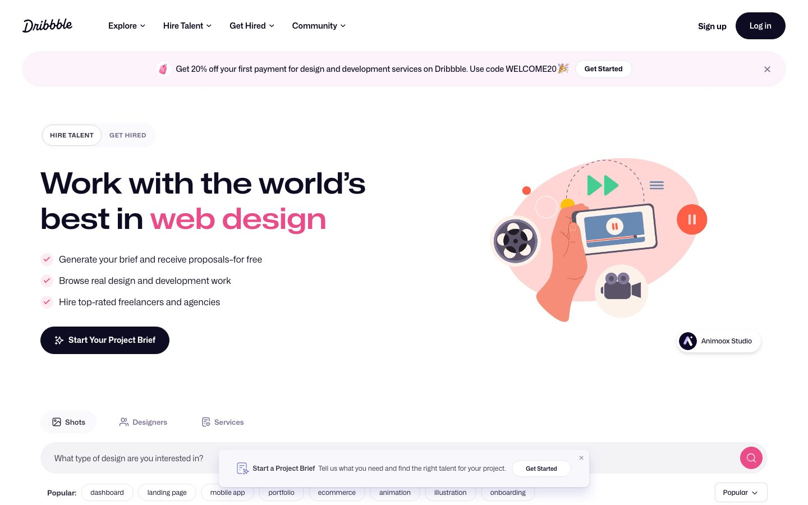

`dribbble.com` — Design portfolio community of "shots" (stills, animations, case studies) with a
freelance hiring marketplace layered on top.
- **Free:** Browsing, search and profiles work without an account; deeper browsing prompts login. Posting and messaging need a free account.
- **Paid:** Pro Lite $4/mo · Pro Standard $8/mo · Pro Plus $99/mo (billed annually). Buys profile/search ranking, project-brief credits, 0% freelance payout fee, team seats, analytics.
- **Subscription needed?** **No** — every paid tier is seller-side. Inspiration browsing is free forever.
- **License:** None granted. Designers retain full rights; contact the creator before any reuse.
- **API:** Public API at `developer.dribbble.com`, but content stays user-owned — you inherit each member's restrictions.
- **Best for:** Polished shot-level UI inspiration and finding individual designers.
- **Watch-out:** Shots are single images, not shipped product UI — aspirational, not verified truth.

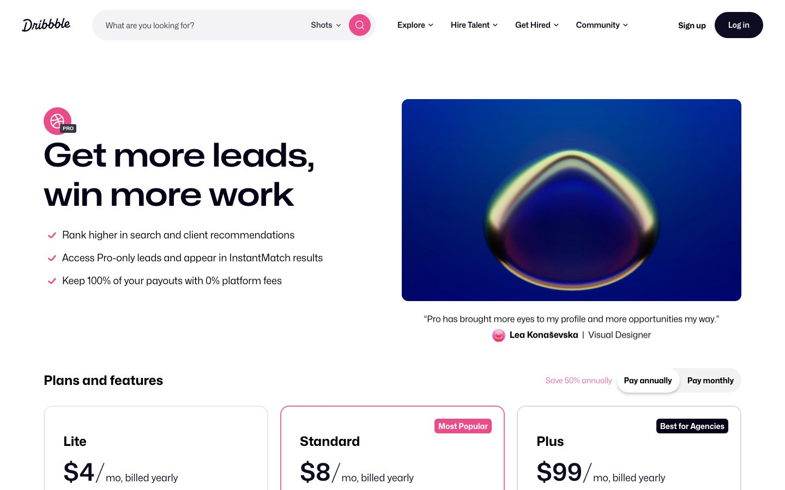

#### Behance
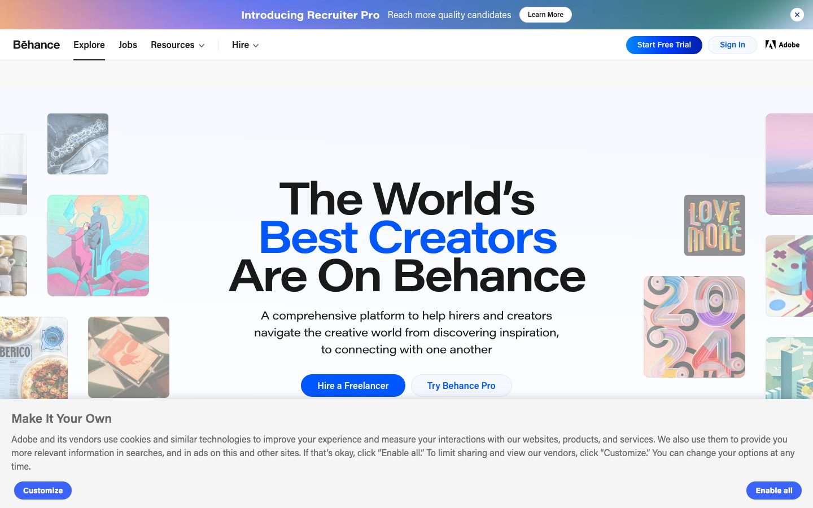

`behance.net` — Adobe-owned portfolio platform hosting full case-study-scale projects across graphic
design, illustration, photography, UI/UX and motion.
- **Free:** Much browsing works logged-out, but "Log in or sign up to view more projects" appears quickly — a free Adobe ID is effectively required.
- **Paid:** Behance Pro from ~$9.99/mo annual, 7-day trial. `unverified` exact current price.
- **Subscription needed?** **No** for browsing — Pro is for selling your own services.
- **License:** None granted; creators own their work.
- **API:** 🔴 **Dead.** The public API went offline ~2021 during an Adobe migration and has not returned. Do not plan integrations around it.
- **Best for:** Full project breakdowns rather than single shots.
- **Watch-out:** Scraping is the only unofficial route and violates Adobe's terms.

#### Awwwards
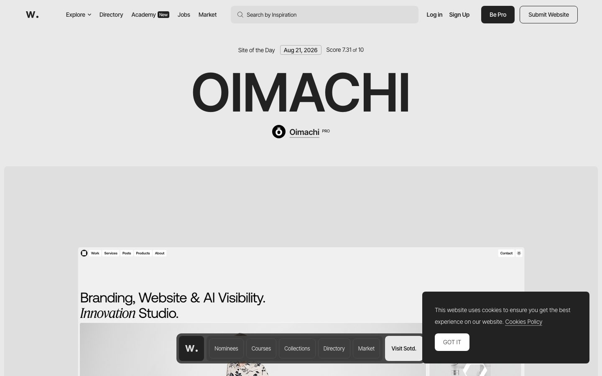

`awwwards.com` — Awards site that curates and scores **whole live websites** via jury plus community vote.
- **Free:** All winners, nominees, collections and articles browse free, no account.
- **Paid:** Membership ~$6.70–13.80/mo billed annually. Submitting a site costs ~$55–65 `unverified`, or ~$165/yr membership bundling one submission.
- **Subscription needed?** **No** — payment is only for submitting your own site or course/marketplace discounts.
- **License:** None — these are live third-party sites.
- **API:** None.
- **Best for:** Full-site inspiration judged on design, usability, creativity and content.
- **Watch-out:** Submission pricing is inconsistent across sources — verify at `awwwards.com/submit`.

#### Godly → **Recent**
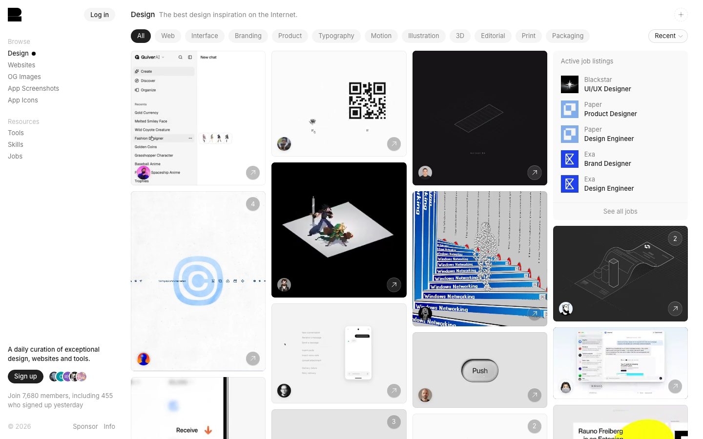

`godly.website` **301 → `recent.design`** — hand-picked daily feed of standout site design.
- **Free:** Everything. Free account only needed to submit sites or hold a maker profile.
- **Paid:** Free — no paid tier.
- **Subscription needed?** Not needed.
- **License:** None — showcases third-party live sites.
- **API:** None.
- **Best for:** A small, tightly curated daily dose that doesn't overwhelm.
- **Watch-out:** 🟠 **The brand has been renamed.** Update the catalogue to Recent / `recent.design`.

#### Land-book
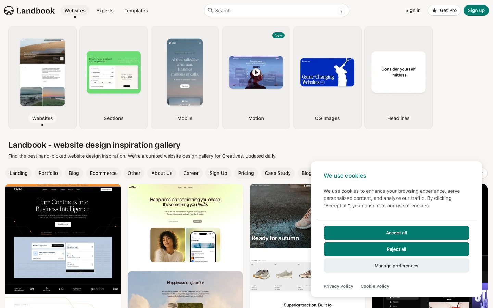

`land-book.com` — Gallery devoted specifically to **landing pages**, organised into boards and sections
(pricing pages, hero sections, footers) with a template marketplace attached.
- **Free:** Basic account — limited categories/sections, **3 boards**, 3 profile sites, limited filters and search.
- **Paid:** Pro **$9/mo**, or **$6/mo billed annually** → unlimited categories/boards/filters, mobile previews, historical site versions, "Hire me" button, 10 showcased sites. Submissions are separately paid.
- **Subscription needed?** **Yes, quickly** — 3 boards and crippled search is a low ceiling for real research.
- **License:** None — third-party live pages.
- **API:** None.
- **Best for:** Section-level landing page inspiration (heroes, pricing tables, footers).
- **Watch-out:** Submission and marketplace fees stack on top of the Pro subscription.

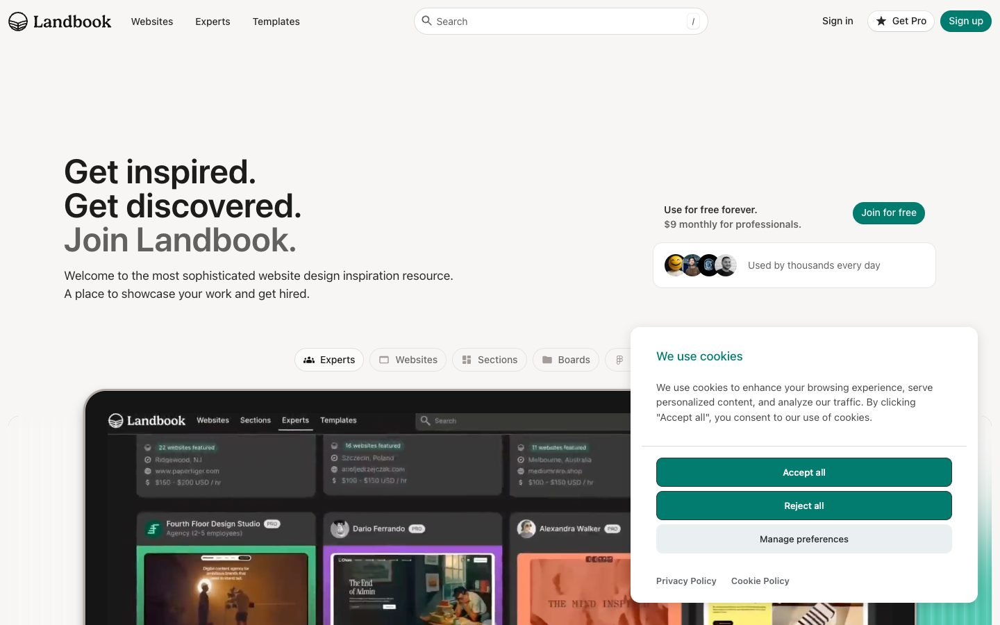

---

### Real Interfaces

#### Mobbin
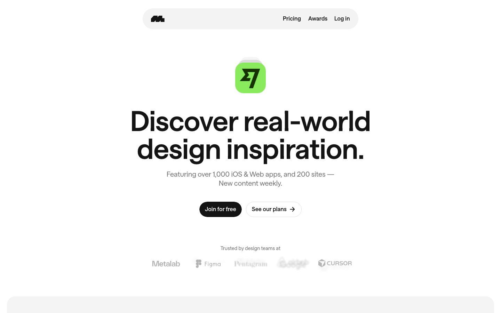

`mobbin.com` — Large library of **real, production** mobile and web UI screenshots and complete user
flows, organised by app and category.
- **Free:** Recently-added apps, limited search, ~3 collections. *(Caps are third-party sourced — `mobbin.com/pricing` blocks automated fetch.)*
- **Paid:** Starter ~$20/seat/mo, Pro ~$40/seat/mo billed annually, custom Enterprise with API + SSO. **`unverified`** — sources conflict badly (some quote $10–15/mo). Check live before budgeting.
- **Subscription needed?** **Yes** — the free tier shows only a recent slice; historical catalogue and flow recordings are gated.
- **License:** `unverified` — treat screenshots as reference-only, never redistribute.
- **API:** Enterprise tier reportedly includes one; no self-serve API. Scraping likely breaches ToS.
- **Best for:** Deep, non-mockup UI pattern research at scale.
- **Watch-out:** Do not quote a price without checking `mobbin.com/pricing` directly.

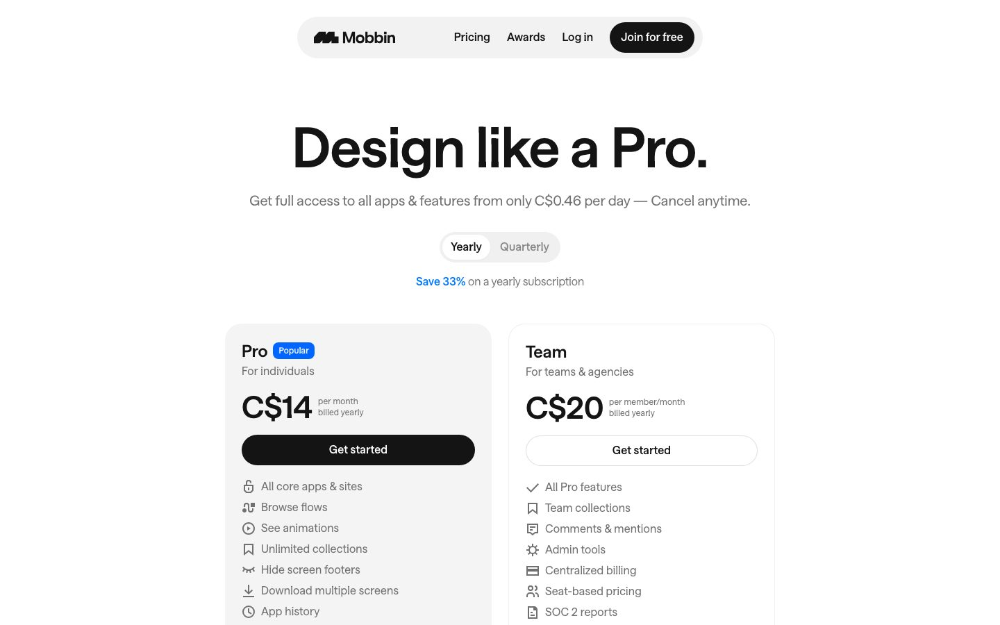

#### Screenlane → **Page Flows**
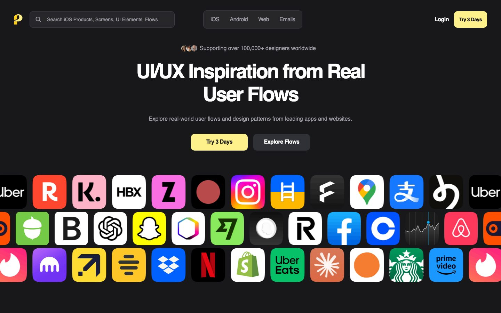

`screenlane.com` **301 → `pageflows.com`** — merged into Page Flows.
- **Subscription needed?** N/A — no longer a distinct product.
- **Watch-out:** 🔴 **Dead brand and a duplicate entry** — it points at the same destination as the Page Flows card next to it. Remove from the catalogue.

#### Page Flows
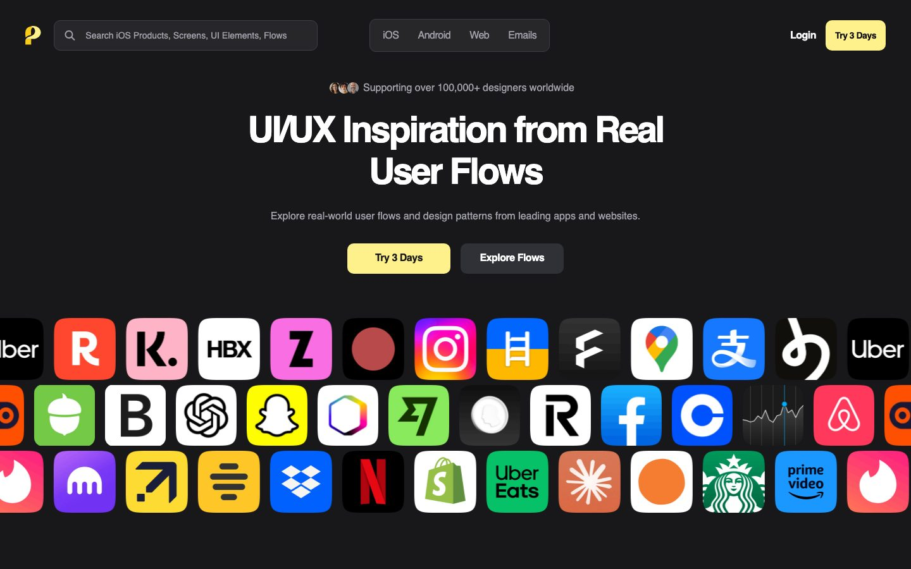

`pageflows.com` — 2,000+ screen-recorded, step-annotated **real user flows** (onboarding, checkout,
login, booking) across iOS, Android, web and email. Absorbed Screenlane.
- **Free:** 🔴 **None.** Only a **paid, non-refundable $2.95 three-day trial**.
- **Paid:** $13/mo billed quarterly ($39/qtr) · **$8.25/mo billed yearly ($99/yr)** — unlimited flows, enhanced search, batch downloads. Team $199/yr for 3 seats (expandable to 10).
- **Subscription needed?** **Yes — completely.** There is no free browsing whatsoever.
- **License:** `unverified`; recordings are of third-party products — reference-only.
- **API:** None.
- **Best for:** Sequential multi-step UX flow research, not single screens.
- **Watch-out:** The "trial" is a real charge, not a free trial.

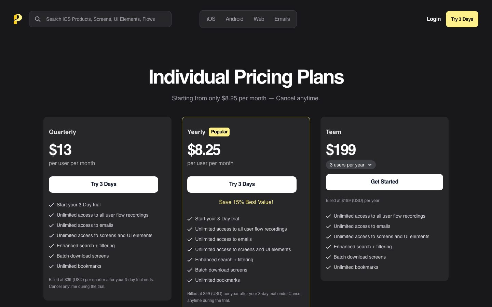

#### UI Sources → **ScreensDesign**
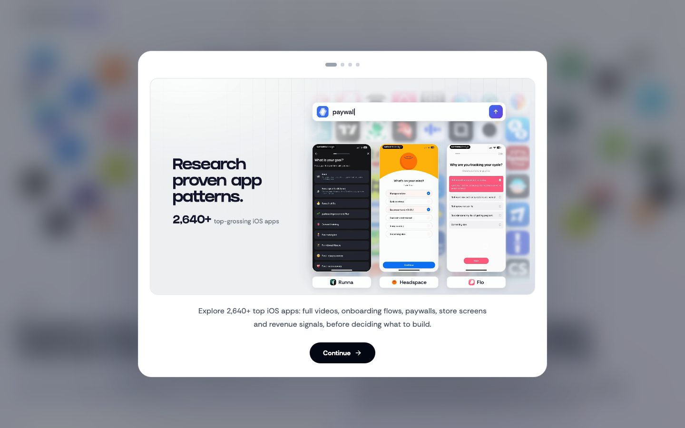

`uisources.com` **301 → `screensdesign.com`** — iOS-focused app design library, 1,500+ apps, category
browsing, featured teardowns.
- **Free:** Core browsing appears open, but a Pro tier gates video flows and paywall research. Split is `unverified`.
- **Paid:** `unverified` — the pricing page yielded no extractable figures.
- **Subscription needed?** Likely for video flows and full depth — `unverified`.
- **License / API:** `unverified` / none found.
- **Best for:** iOS UI screenshots and onboarding/paywall teardowns.
- **Watch-out:** 🟠 **Renamed product.** Rename and repoint the catalogue entry.

#### Collect UI
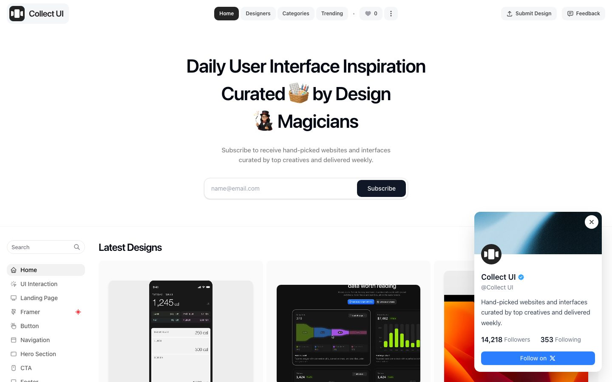

`collectui.com` — Daily UI inspiration feed hand-picked from the Daily UI challenge archive and Dribbble,
plus a large weekly newsletter.
- **Free:** Entirely — no signup to browse.
- **Paid:** Free. Monetised through sponsor listings aimed at vendors, not viewers.
- **Subscription needed?** Not needed.
- **License:** Underlying shots come from Dribbble/Daily UI — **creator-owns-rights still applies**.
- **API:** None.
- **Best for:** Fast, no-login daily-UI browsing.
- **Watch-out:** Free to browse ≠ free to reuse.

---

### Motion

#### GSAP
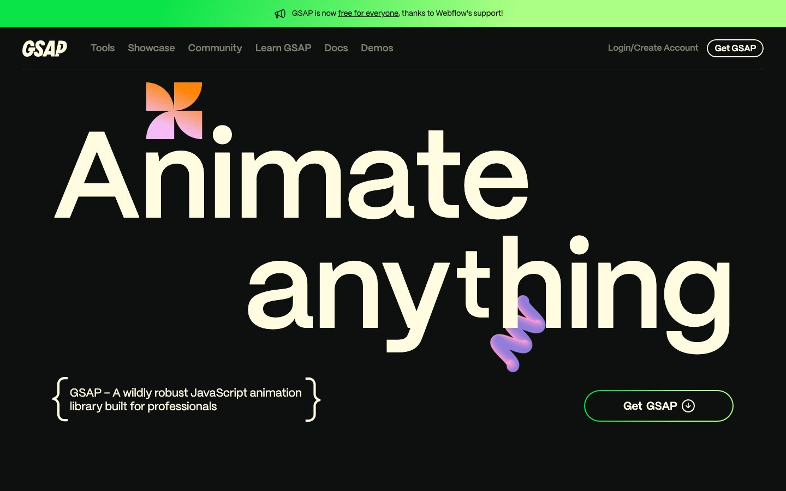

`gsap.com` — The GreenSock Animation Platform: the industry-standard JS animation engine, with
ScrollTrigger, SplitText and the rest of the plugin suite. The team is now employed by Webflow.
- **Free:** ✅ **Everything.** GSAP is now "100% free for all users, thanks to Webflow's support" — the full library *and all plugins*, previously the paid "Club GSAP" tier.
- **Paid:** Free — no paid tier. The Club GSAP model was retired.
- **Subscription needed?** Not needed — this is a genuine and recent improvement.
- **License:** No usage restrictions in current messaging; treat as commercially free. Exact SPDX identifier `unverified` — check the repo LICENSE for legal precision.
- **API:** `gsap` on npm, plus a public CDN build.
- **Best for:** Production scroll-driven, timeline and SVG/text animation.
- **Watch-out:** None — just confirm there's been no regression to paid tiers before committing.

#### Animations.dev
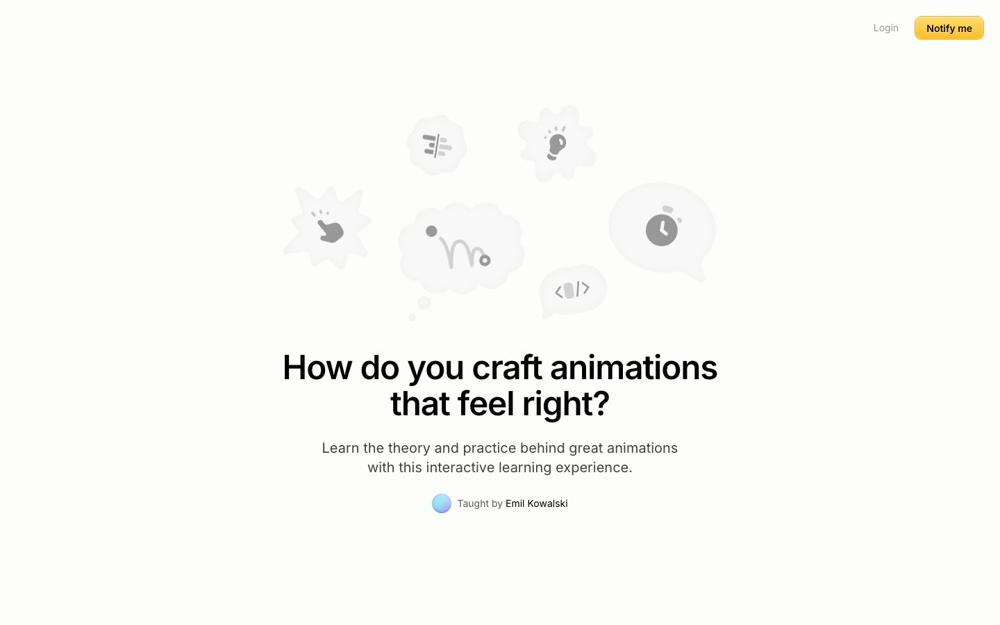

`animations.dev` — A **paid course**, not a gallery: web animation theory and implementation (CSS, Framer
Motion, advanced technique) by Emil Kowalski, creator of Sonner and Vaul, currently at Linear.
- **Free:** Marketing pages; a waitlist unlocks **two preview lessons** plus occasional behind-the-scenes content.
- **Paid:** **$199 one-time** — four modules, walkthroughs, private Discord, AI skills package, lifetime access with quarterly updates. 10–20% multi-seat discount, 20% student discount, refundable anytime.
- **Subscription needed?** It's a one-time purchase, and yes — everything past two lessons is paywalled.
- **License / API:** N/A — educational content.
- **Best for:** Learning animation craft in depth from a recognised practitioner.
- **Watch-out:** Enrollment runs in open/closed windows — you may not be able to buy on demand.

#### Transitions.dev

`transitions.dev` — Copy-paste UI transitions (dropdowns, modals, buttons, toggles, skeleton loaders) by
Jakub Antalik, with a GitHub repo and an **agent skill for AI coding tools**.
- **Free:** The core set as **CSS snippets**, no signup.
- **Paid:** Pro — Solo **$9/mo or $149 lifetime**; Team $39/mo for 5 seats ($499 lifetime), +$9/mo per extra seat. Unlocks 36+ transitions with **React/Next/TypeScript variants**, the "Refine" live-tuning tool, the extended agent skill, and an explicit unlimited-projects commercial licence.
- **Subscription needed?** **Only if you want framework code** — CSS-only is genuinely usable free.
- **License:** Commercial use allowed on both tiers; Pro states it explicitly.
- **API:** No API — snippets, a GitHub repo, and an installable AI-agent skill.
- **Best for:** Drop-in micro-interactions, especially in AI-agent workflows.
- **Watch-out:** None — cleanly split free/paid.

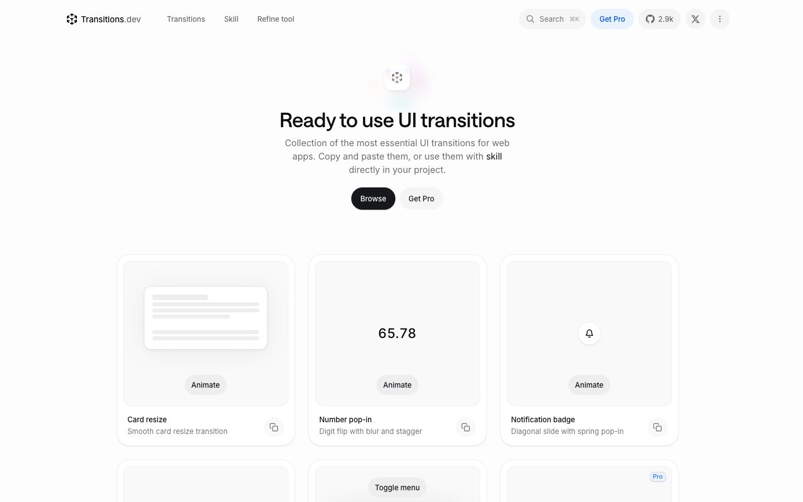

#### Motion Sites
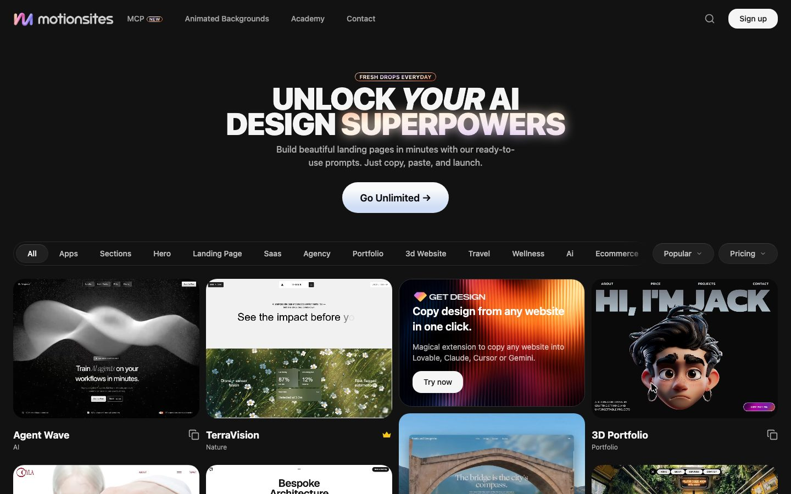

`motionsites.ai` — A library of **AI-website-builder prompts** (for Lovable, Bolt, Cursor, Claude) that
generate animated landing pages, portfolios and SaaS sites, plus an academy and motion assets.
- **Free:** Prompts marked "Copy" are free; premium prompts locked.
- **Paid:** "Go Unlimited" **$149/yr or $239 one-time** → all prompts plus a commercial licence. Animated backgrounds/sections sit behind a **higher, separate tier** (~$239/yr or $349 one-time) `unverified`.
- **Subscription needed?** Yes for the full library **and for commercial rights**.
- **License:** Paid tier includes commercial use; free-prompt terms `unverified`.
- **API:** None — it's a prompt library.
- **Best for:** Bootstrapping AI-generated marketing pages.
- **Watch-out:** Overlapping tiers with inconsistent pricing across sources — verify before budgeting.

#### Motion.page Showcase
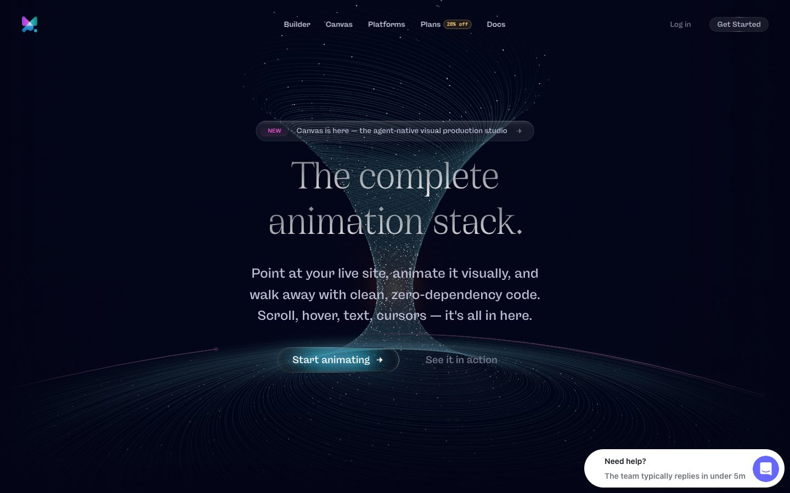

`motion.page` — Visual, no-dependency animation builder spanning Webflow, WordPress, React, Vue, Astro
and Shopify, plus "Canvas", a WebGPU shader editor. The catalogue links its showcase gallery.
- **Free:** 7-day trial only — no ongoing free tier.
- **Paid:** Builder ~€119.20/yr · Canvas ~€119.20/yr · Bundle ~€159.20/yr. Prices seen **with a promo code active** — treat as approximate.
- **Subscription needed?** Yes — the tool requires payment for production use.
- **License:** Outputs "clean, zero-dependency code" you own.
- **API:** A developer SDK exists for the product.
- **Best for:** Real production examples of no-code scroll/interaction animation.
- **Watch-out:** 🟠 **`/showcase/` returns 404.** Repoint the catalogue entry at `motion.page/`.

#### Animography
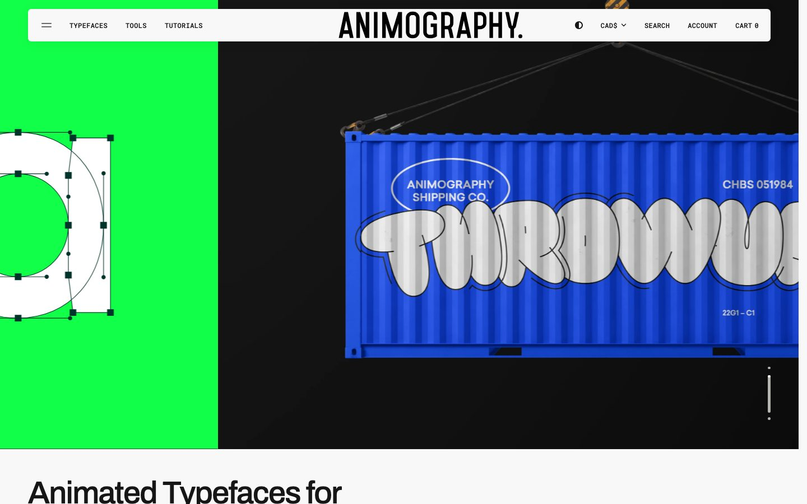

`animography.net` — Marketplace for **animated typefaces** (30+) built as customisable After Effects
project templates, not font files.
- **Free:** A handful of free typefaces (Franchise, Gilbert, Mobilo); ~7-day trials of paid ones.
- **Paid:** Per-typeface, commonly cited ~$120 each `unverified` — the live store shows variable pricing. 25% off when buying 4+.
- **Subscription needed?** **Not a subscription** — you buy individual typefaces.
- **License:** Personal *and* commercial use included per purchase; **redistribution or resale prohibited**.
- **API:** None — downloadable After Effects projects.
- **Best for:** Ready-made animated logotypes and titles for motion work.
- **Watch-out:** Flat "$120 across the catalogue" is not confirmed — check per typeface.

#### React Bits
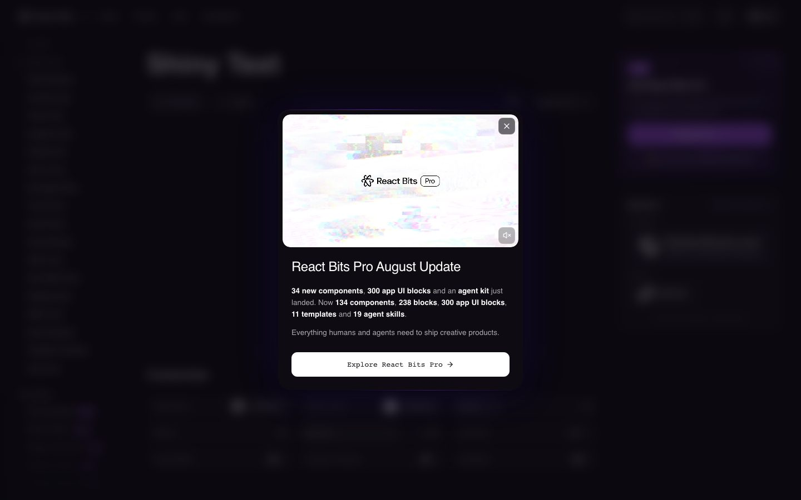

`reactbits.dev` — 165+ animated, interactive React components (text animations, backgrounds, buttons,
scroll effects) plus Background Studio, Shape Magic and Texture Lab.
- **Free:** All of it — view and copy, no signup, nothing paywalled.
- **Paid:** Free — fully open source.
- **Subscription needed?** Not needed.
- **License:** **MIT + Commons Clause** — free for personal and commercial use.
- **API:** Not a versioned dependency — source installs via `npx shadcn@latest add @react-bits/<Component>` or `npx jsrepo add github/DavidHDev/react-bits/...`.
- **Best for:** Drop-in animated React components, very agent-friendly.
- **Watch-out:** ⚠️ Commons Clause is **not plain MIT** — it restricts *selling the library itself*. Using it inside your product is fine.

---
### Color

#### Coolors
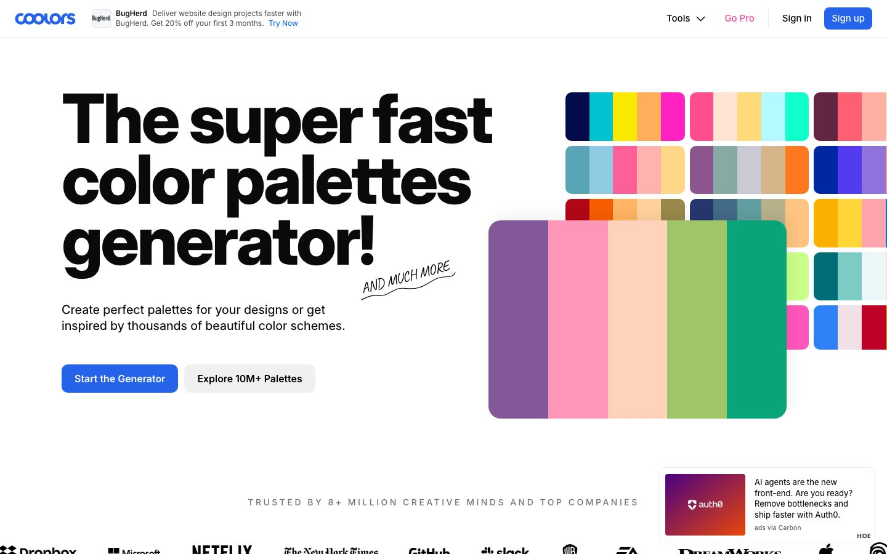

`coolors.co` — Palette generator plus contrast checker, image picker and a library of 10M+ user
palettes. Built by Fabrizio Bianchi; claims 8M+ users.
- **Free:** Palettes up to **5 colors**, **10 saved palettes**, 1 project, 1 collection, 5 favourite colors, full library browsing. Ads. No signup to generate; account needed to save.
- **Paid:** Pro **$3/mo** → 10-color palettes, unlimited everything, Coolors AI (3,000 credits/mo), no ads, advanced exports (**CSS, SVG, Tailwind**, branded PDF), palette variations, private profiles.
- **Subscription needed?** **Yes if you work in it daily** — 10 palettes and 1 project is a low ceiling, and code exports are Pro-gated. At $3/mo it's the cheapest wall on this list.
- **License:** Free for commercial and non-commercial use, **no attribution**. Cannot resell/redistribute palettes, put them on stock sites, use them for **AI/ML training**, mint NFTs, or trademark them.
- **API:** No public developer API; exports are manual downloads, some Pro-gated.
- **Best for:** Fast generation and mining a huge crowdsourced palette library.
- **Watch-out:** The 5-color cap on free bites sooner than the storage cap.

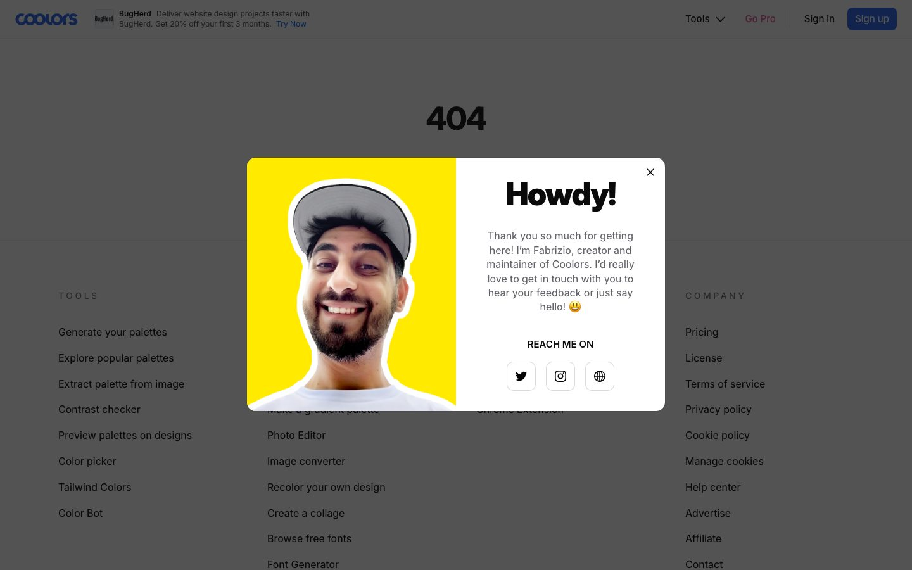

#### Color Hunt
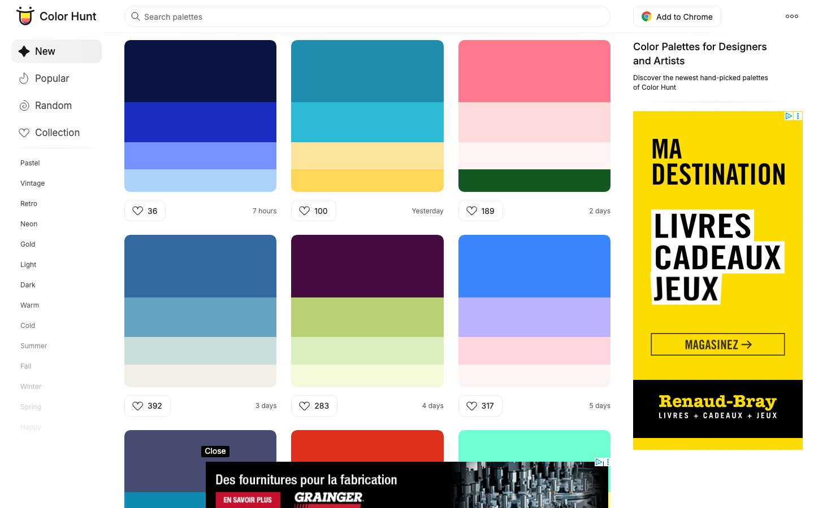

`colorhunt.co` — Curated, community-submitted gallery of **4-color palettes**, searchable by category and trend.
- **Free:** Everything — browse, search, like, no account.
- **Paid:** Free — none advertised.
- **Subscription needed?** Not needed.
- **License:** ⚠️ **`unverified`** — `/terms` returns 403 to automated fetch and no commercial-use text could be confirmed. Check manually before commercial use.
- **API:** None documented.
- **Best for:** Quick browsing of trendy hand-picked 4-color combos.
- **Watch-out:** The licensing gap is the only real caveat.

#### Realtime Colors
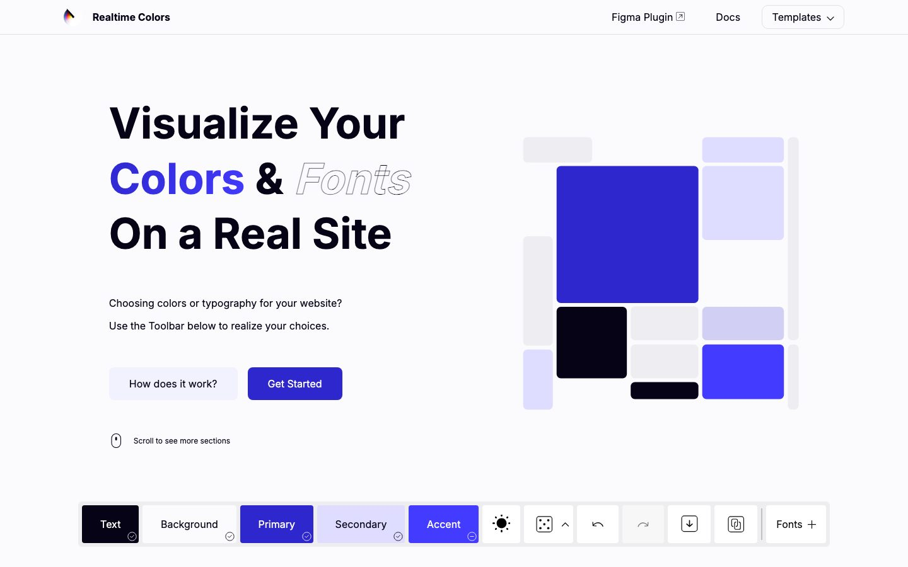

`realtimecolors.com` — Maps text/background/primary/secondary/accent onto a **mock website layout in real
time**, with a built-in WCAG contrast checker and Google Fonts integration.
- **Free:** All of it, no signup — picking, live preview, contrast checking, and exports (CSS, SCSS, Tailwind, QR, file). The site states "100% Free! Forever." Its own "Pro" and "Enterprise" plans both list **$0.00/month**.
- **Paid:** Free — no paid tier.
- **Subscription needed?** Not needed.
- **License:** Colors you generate are yours, commercial or not. Note the *site/source itself* is CC BY-NC-ND — that governs reusing the tool, not your output.
- **API:** None. Figma plugin with 19K+ users.
- **Best for:** Seeing a palette on a real UI before you commit to it.
- **Watch-out:** None.

#### Adobe Color
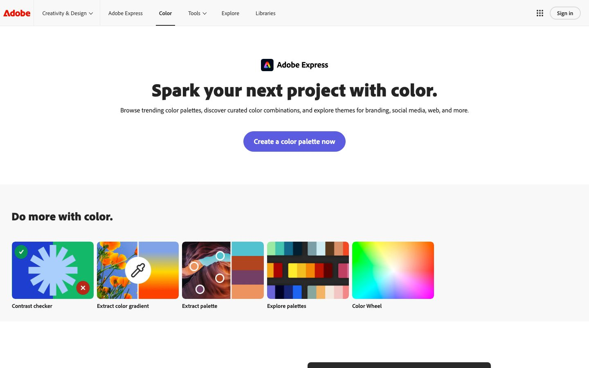

`color.adobe.com` — Adobe's color wheel and theme generator with image extraction, contrast checking, and
a community library sourced from Adobe Stock, Behance and users.
- **Free:** Full creation and exploration with **no account**; sign-in only prompted on "Save". A free Adobe ID (2GB) covers it.
- **Paid:** Adobe Express Premium / Creative Cloud (figures `unverified` — confirm at adobe.com) let you auto-apply palettes into CC design files. The Color tool itself stays free.
- **Subscription needed?** **No** for generating hex values; only to push palettes straight into Express/CC.
- **License:** Themes are free to use commercially. ⚠️ If a theme came from an **Adobe Stock image**, the colors are free but **licensing that image is separate and paid**.
- **API:** None found.
- **Best for:** Extracting palettes from imagery inside the Adobe ecosystem.
- **Watch-out:** Adobe's own subscription figures move constantly — reconfirm before quoting.

#### Happy Hues
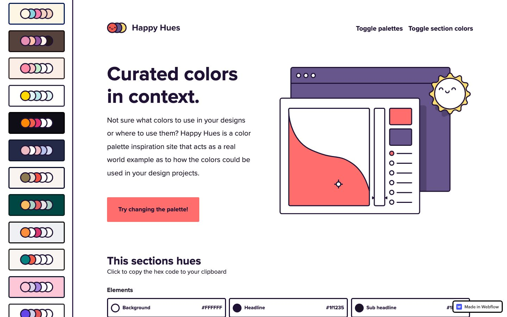

`happyhues.co` — Mackenzie Child's side project: palettes applied to realistic UI/illustration mockups so
you see them **in context** rather than as flat swatches. 17+ curated palettes.
- **Free:** Everything, no signup, no paywall.
- **Paid:** Free — no paid tier.
- **Subscription needed?** Not needed.
- **License:** ⚠️ **`unverified`** — no published palette licence, only a general copyright footer. Using hex values is standard practice; reusing the mockup artwork is not covered.
- **API:** None.
- **Best for:** Judging how a palette behaves across real UI components.
- **Watch-out:** No explicit licence text.

---

### Typography

#### Google Fonts
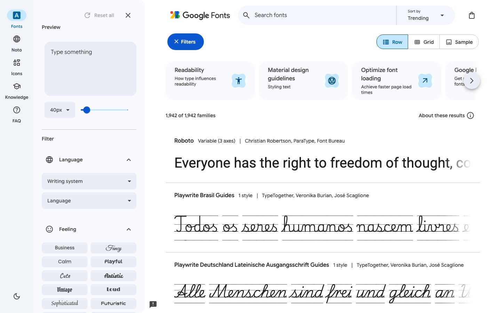

`fonts.google.com` — ~1,900+ open-source families across every category, servable from Google's CDN or self-hosted.
- **Free:** Everything — browse, filter, download, embed. No signup.
- **Paid:** Free — no paid tier.
- **Subscription needed?** Not needed.
- **License:** **SIL OFL 1.1** (the large majority) or **Apache-2.0**. Both allow free personal *and* commercial use, editing and redistribution, provided the licence notice travels with redistributed copies. OFL fonts can't be sold standalone (only bundled) and reserved names can't be reused for derivatives. **No attribution required.**
- **API:** Google Fonts Developer API at `fonts.googleapis.com`; bulk raw files in the `google/fonts` GitHub repo; `google-webfonts-helper` and npm wrappers unofficially.
- **Best for:** The default, zero-friction, licence-safe font source.
- **Watch-out:** Check the family's own licence file if you're going beyond webfont embedding — e.g. selling font-based merch.

#### Fontshare
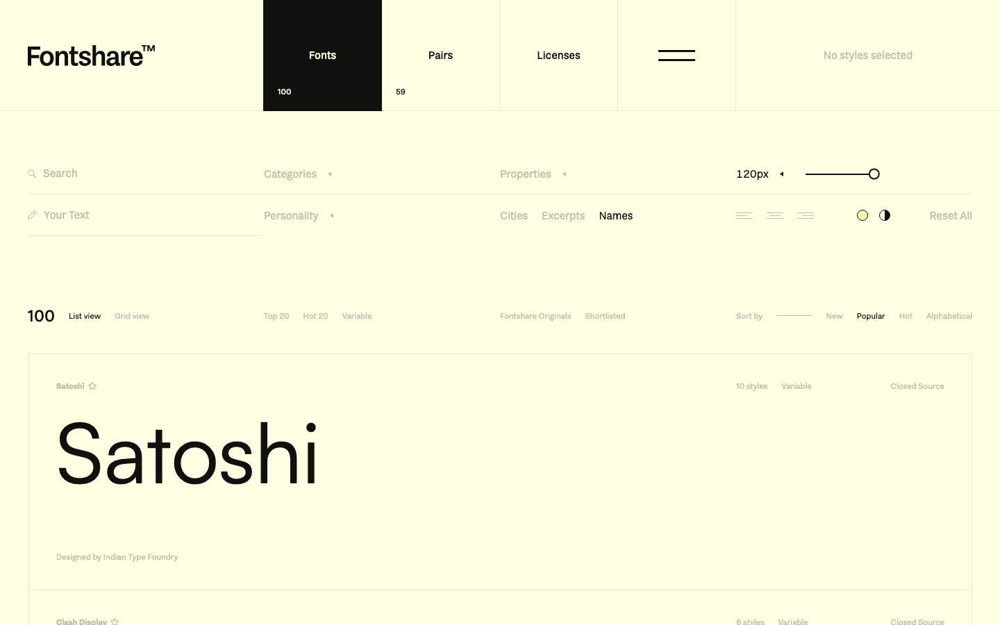

`fontshare.com` — The Indian Type Foundry's free-distribution channel: ~100 professionally designed
families built to rival retail type.
- **Free:** All ~100 families, downloadable and CDN-embeddable. Whether an account is needed is `unverified`.
- **Paid:** Free — this *is* ITF's free channel.
- **Subscription needed?** Not needed.
- **License:** ⚠️ **Two licences, per font** — **SIL OFL 1.1** for some, ITF's own **Free Font License (ITF-FFL)** for others. ITF-FFL allows unrestricted personal and commercial use (print, digital, broadcast, client work, products for sale) with **no attribution**; you may **not** resell the font files or redistribute them via other font platforms.
- **API:** No API; per-font downloads and CDN links.
- **Best for:** Free, professional alternatives to expensive retail typefaces.
- **Watch-out:** Confirm which of the two licences applies before redistributing any font file.

#### Typewolf
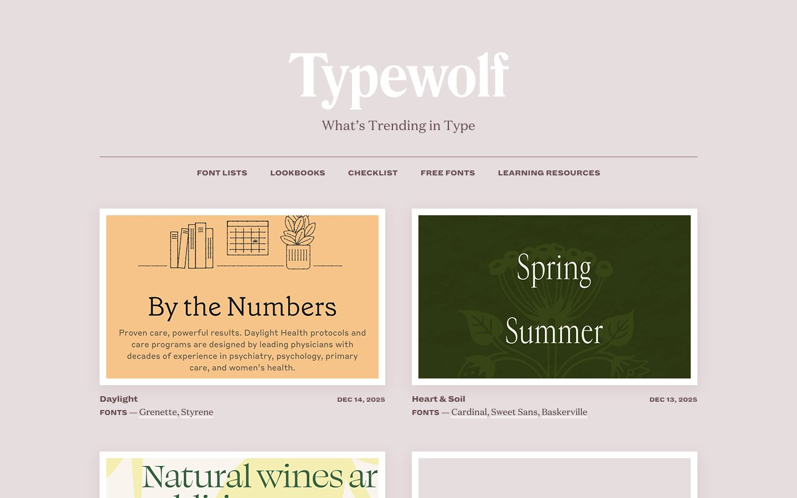
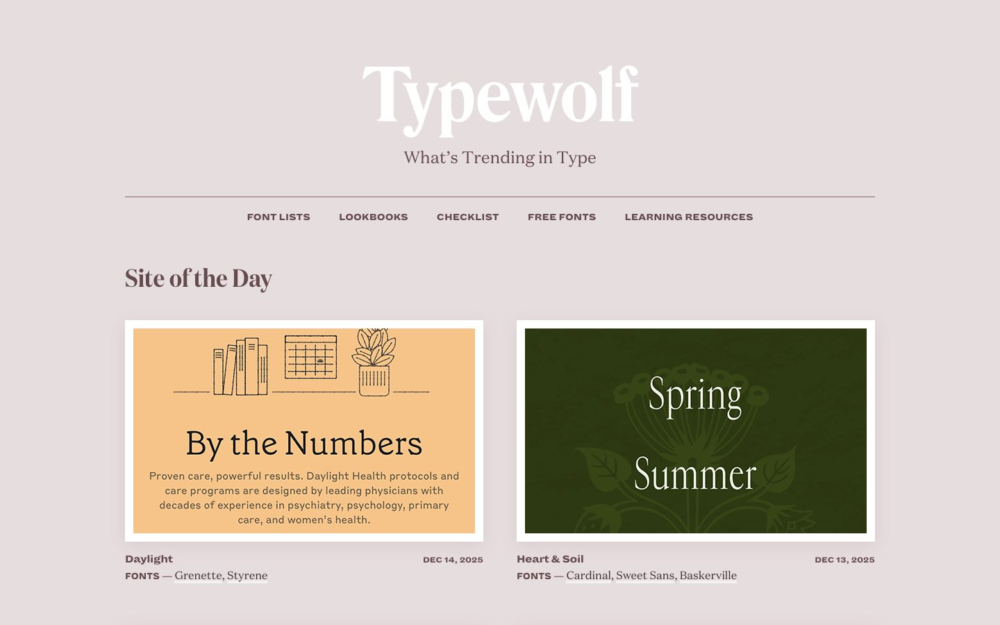

`typewolf.com` — Jeremiah Shoaf's typography reference: daily "Site of the Day" font identification,
curated best-of lists and articles. 350,000+ monthly visitors.
- **Free:** **All core content** — Site of the Day, font lists, articles, search, newsletter.
- **Paid:** The **Flawless Typography Checklist**, **$399 one-time** — a typography course/reference, **not a recurring subscription**.
- **Subscription needed?** **No.** The reference value is entirely free; only the course costs money.
- **License:** N/A — Typewolf distributes no fonts, it links to Google Fonts, Adobe Fonts and foundries.
- **API:** None.
- **Best for:** Identifying what real, well-designed sites are actually setting type in.
- **Watch-out:** Don't misread the $399 as a subscription.

#### Fontpair
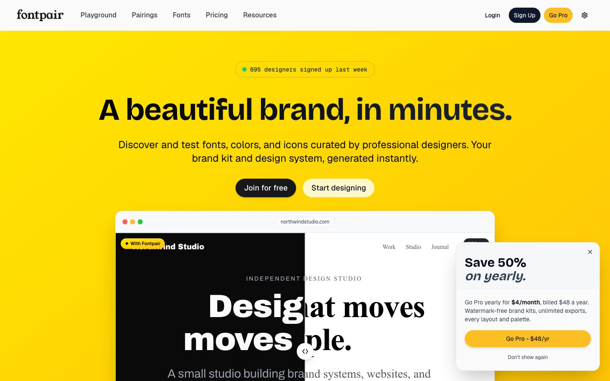

`fontpair.co` — 1,000+ curated font **pairings** drawn from Google Fonts and Fontshare; used by 30,000+ designers.
- **Free:** Browse and test pairings without an account. Free account to save favourites.
- **Paid:** Pro **$8/mo**, or **$4/mo billed yearly** → unlimited exports, Chrome extension, 500+ extra curated pairings.
- **Subscription needed?** Only for exports at volume or the extended pairing set.
- **License:** Inherits Google Fonts (OFL/Apache) and Fontshare (OFL/ITF-FFL) — all commercially safe.
- **API:** None documented.
- **Best for:** Testing heading/body combinations fast.
- **Watch-out:** None — underlying font licences are the safe ones.

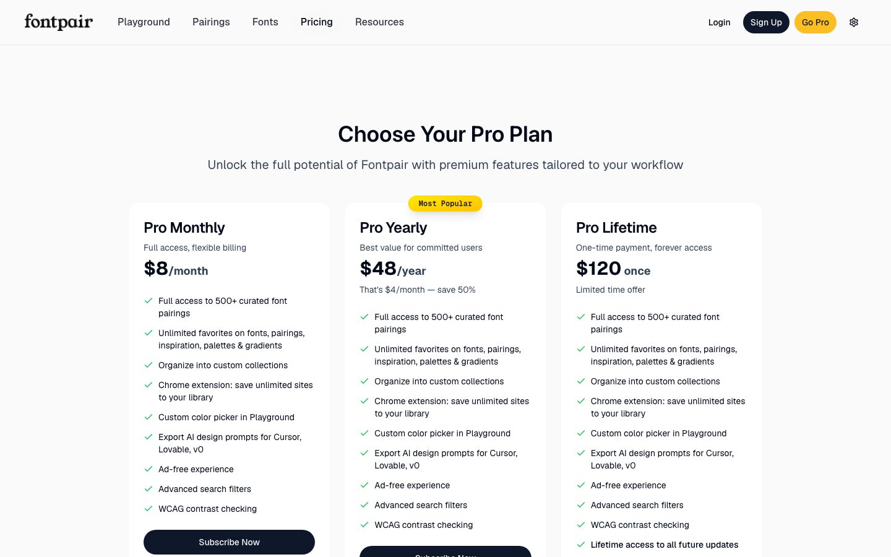

#### Fonts In Use
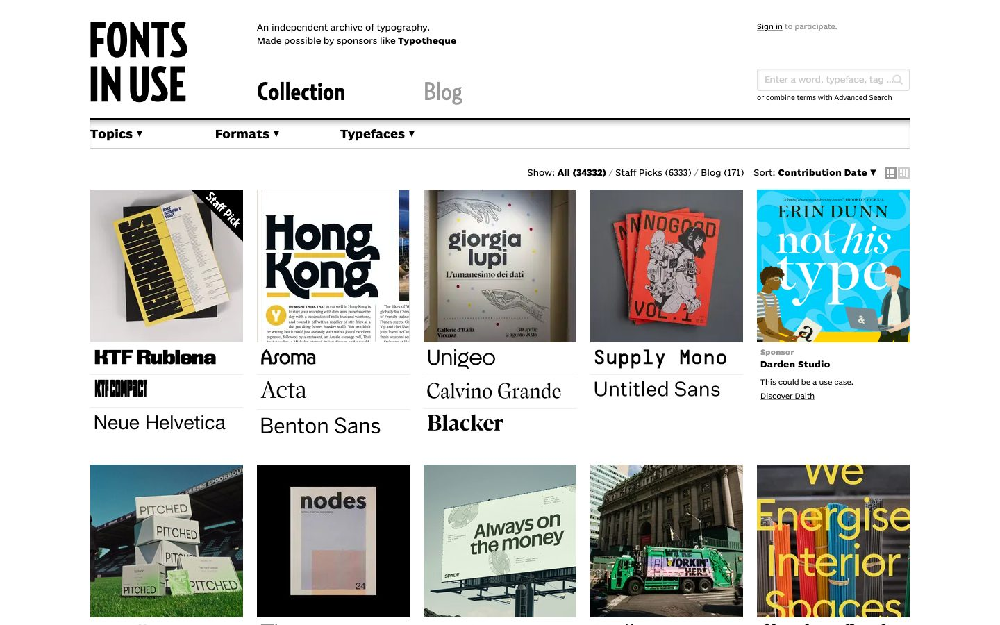

`fontsinuse.com` — Independent community archive documenting **real-world typography** in branding,
packaging, publications and web, running since 2010, searchable by typeface, topic or format.
- **Free:** Full browsing, filtering, search, blog and RSS.
- **Paid:** `unverified` — none found; appears fully community-funded.
- **Subscription needed?** Not needed.
- **License:** ⚠️ **Reference only.** Entries are individually credited photos of **real copyrighted branded work** — not license-free assets. Never treat catalogued images as reusable.
- **API:** None; RSS feeds per category.
- **Best for:** Studying how a typeface actually performs in editorial and branding contexts.
- **Watch-out:** This is an archive of other people's work, not an asset source.

---

### Icons

#### The SVG
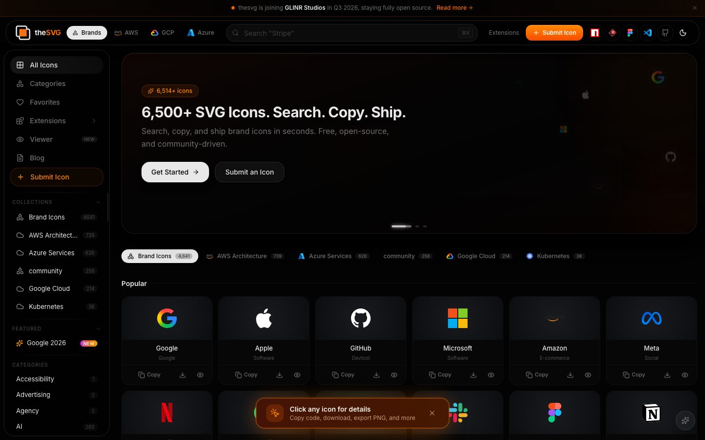

`thesvg.org` — 6,500+ free **brand/logo** SVG icons, maintained openly at `glincker/thesvg`.
- **Free:** All 6,500+, no signup.
- **Paid:** Free — no paid tier.
- **Subscription needed?** Not needed.
- **License:** ⚠️ **Two layers.** The codebase is **MIT**; the logos remain their owners' **trademarks**, distributed under *nominative fair use* — "Sign in with Google" buttons, comparison tables, docs and editorial use are fine. Don't modify logos against brand guidelines, imply endorsement, or use marks on merch without checking each brand's rules.
- **API:** MIT package/repo on GitHub, npm-installable, bulk download available.
- **Best for:** Developer-ready brand marks for auth buttons and integration badges.
- **Watch-out:** MIT on the package is not permission to use the trademark.

#### SVG Logos
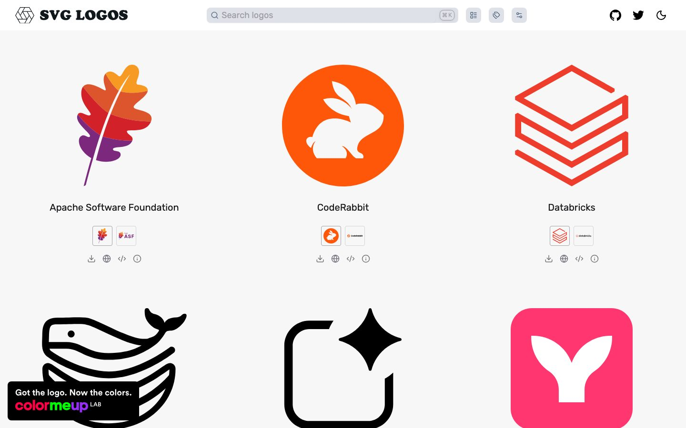

`svglogos.dev` — Open-source library of hundreds of technology and company brand marks in SVG.
- **Free:** Browse and download everything, no signup found.
- **Paid:** Free — no paid tier.
- **Subscription needed?** Not needed.
- **License:** Site/codebase **MIT**; the logos are their owners' IP. Verify usage rights with each trademark holder for commercial deployment.
- **API:** Open GitHub repo; per-logo direct downloads. No formal API.
- **Best for:** Fast access to well-known tech logos for integration and comparison UIs.
- **Watch-out:** Same trademark caveat as The SVG.

#### Lobe Icons
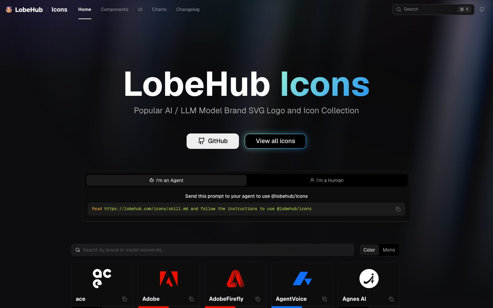

`icons.lobehub.com` — AI/LLM brand logos (OpenAI, Anthropic, Claude and the rest) for React and React
Native, shipped as static SVG/PNG/WebP with **no runtime dependencies**.
- **Free:** All icons, no signup.
- **Paid:** Free — none found.
- **Subscription needed?** Not needed.
- **License:** **MIT** (`lobehub/lobe-icons`). Same trademark caution — the AI-company marks belong to those companies.
- **API:** npm `@lobehub/icons`, `@lobehub/icons-rn`, `@lobehub/icons-static-svg`, `@lobehub/icons-static-png`; CDN-servable via unpkg.
- **Best for:** Accurate, current AI-company logos in a model-picker UI.
- **Watch-out:** MIT covers the package, not the marks.

#### Iconify
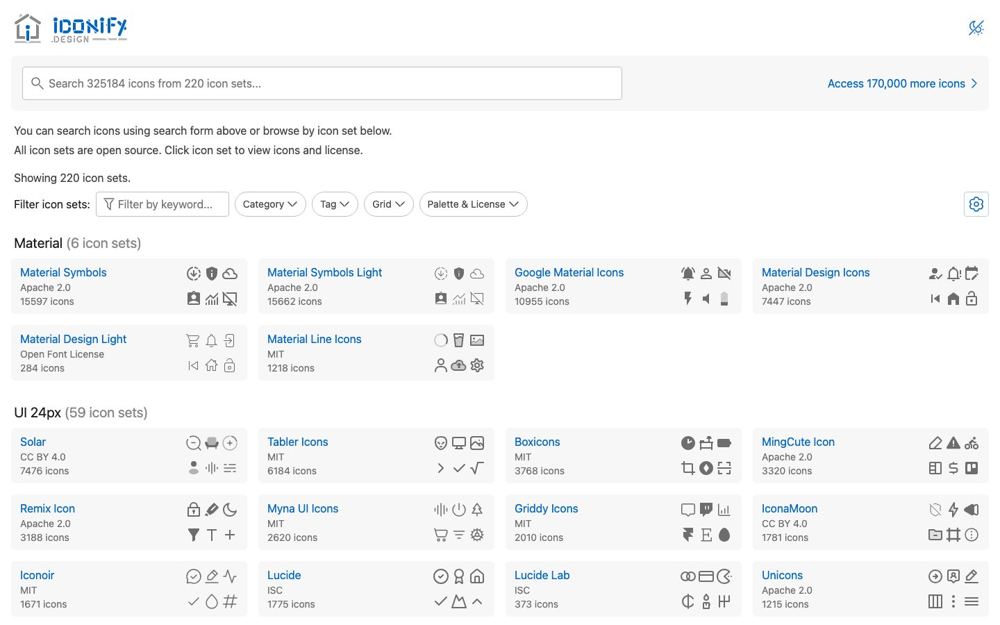
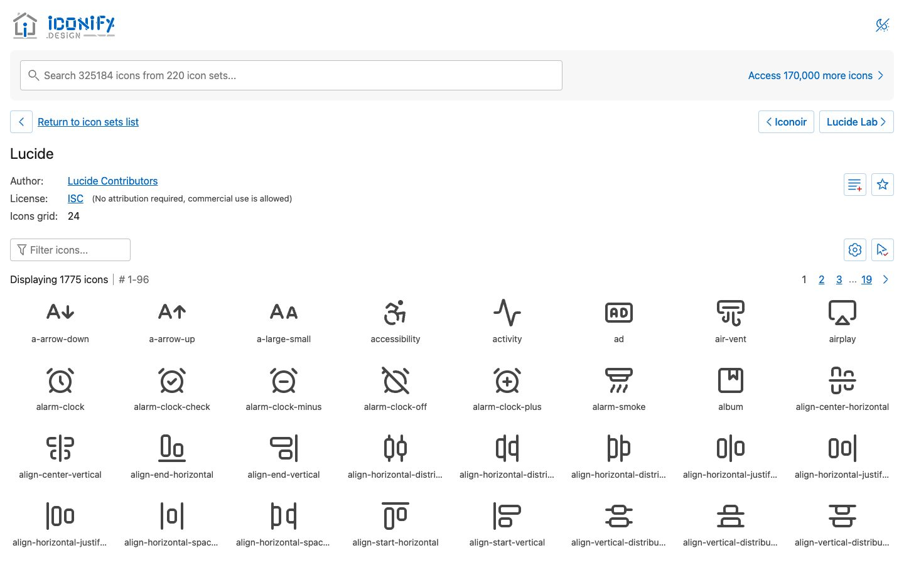

`icon-sets.iconify.design` — Universal icon framework unifying **200+ open-source sets** (~200,000–325,000
icons) behind one syntax across React, Vue, Svelte and web components.
- **Free:** Entirely — all sets, all search, and the public API, no signup.
- **Paid:** Free — the public API is free to use, and self-hosting it is free and open source.
- **Subscription needed?** Not needed.
- **License:** ⚠️ **Varies per set** — Iconify's framework licence does **not** cover the icons. Each set carries its own (MIT, Apache-2.0, CC0, CC-BY), documented in `collections.md`. Never assume one blanket licence across 200+ sets.
- **API:** `https://api.iconify.design`; npm `@iconify/iconify`, `@iconify/react`, `iconify-icon`; `@iconify/api` (MIT) for self-hosting; `iconify/icon-sets` repo for bulk data, auto-updated several times weekly.
- **Best for:** One integration covering nearly every open-source icon set, with per-icon licence metadata.
- **Watch-out:** The per-set licence check is mandatory, not optional.

#### Lucide
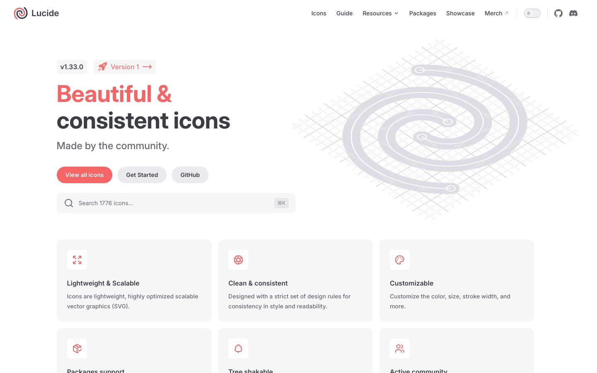
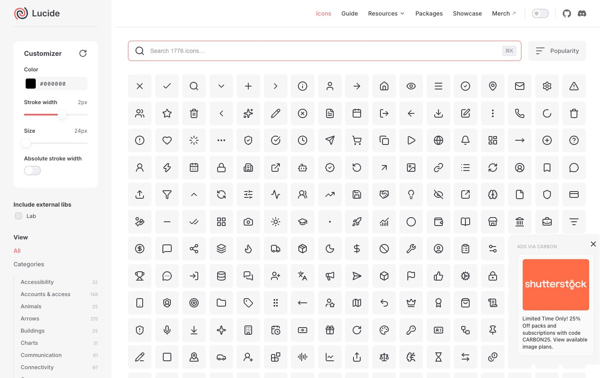

`lucide.dev` — Community-maintained continuation of Feather Icons: **1,776 icons** in one consistent
style, with first-party packages for React, Vue, Svelte, Solid, Preact, Angular, Astro and React Native.
- **Free:** Everything, no restrictions.
- **Paid:** Free — no paid tier.
- **Subscription needed?** Not needed.
- **License:** **ISC** — permissive, MIT-like. Commercial use, modification and redistribution all fine.
- **API:** npm `lucide`, `lucide-react`, `lucide-vue`, `lucide-svelte` — all tree-shakable. LLM-readable docs at `/llms.txt` and `/llms-full.txt`.
- **Best for:** The default consistent icon set for a modern app.
- **Watch-out:** None.

#### Heroicons
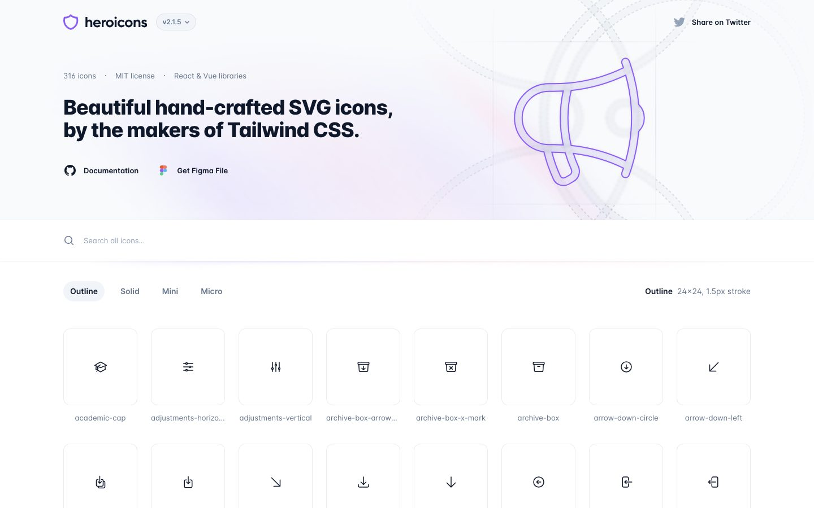

`heroicons.com` — 316 hand-crafted icons from the Tailwind CSS team, in Outline, Solid, Mini and Micro.
- **Free:** All icons and both component libraries.
- **Paid:** Free — no paid tier.
- **Subscription needed?** Not needed.
- **License:** **MIT.**
- **API:** npm `@heroicons/react` (199M+ downloads) and `@heroicons/vue`; paths like `@heroicons/react/24/outline`. Figma Community file available.
- **Best for:** A polished set with matched design language across every size, native to the Tailwind ecosystem.
- **Watch-out:** 316 icons is deliberately narrow — pick Iconify or SVG Repo when you need breadth.

#### SVG Repo
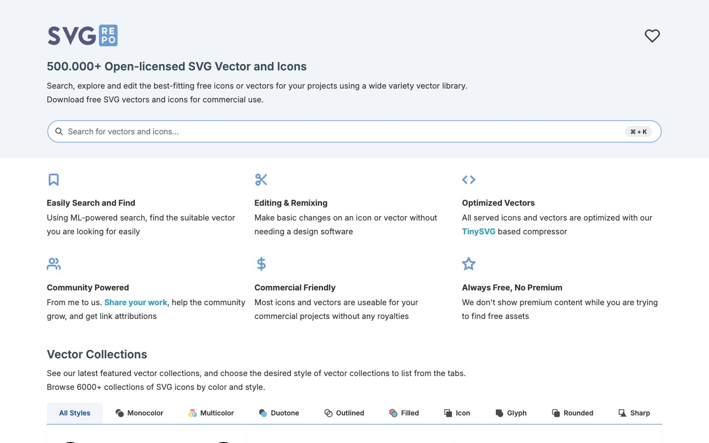

`svgrepo.com` — Very large aggregator, reported at ~460K–500K+ vectors across 6,000+ collections.
- **Free:** Browse and download free-licensed assets without signup.
- **Paid:** `unverified` — no confirmed premium plan; the service appears to operate as a free resource.
- **Subscription needed?** No confirmed paywall.
- **License:** ⚠️ **Varies per icon** — CC0 1.0, MIT, public domain, or contributor-set custom terms. Most are commercially usable royalty-free, but each icon's licence badge must be checked individually (`svgrepo.com/page/licensing/`).
- **API:** No public developer API confirmed.
- **Best for:** High-volume search when you need something very specific.
- **Watch-out:** Do **not** assume blanket CC0 across the catalogue.

---
### Illustration

#### Storyset
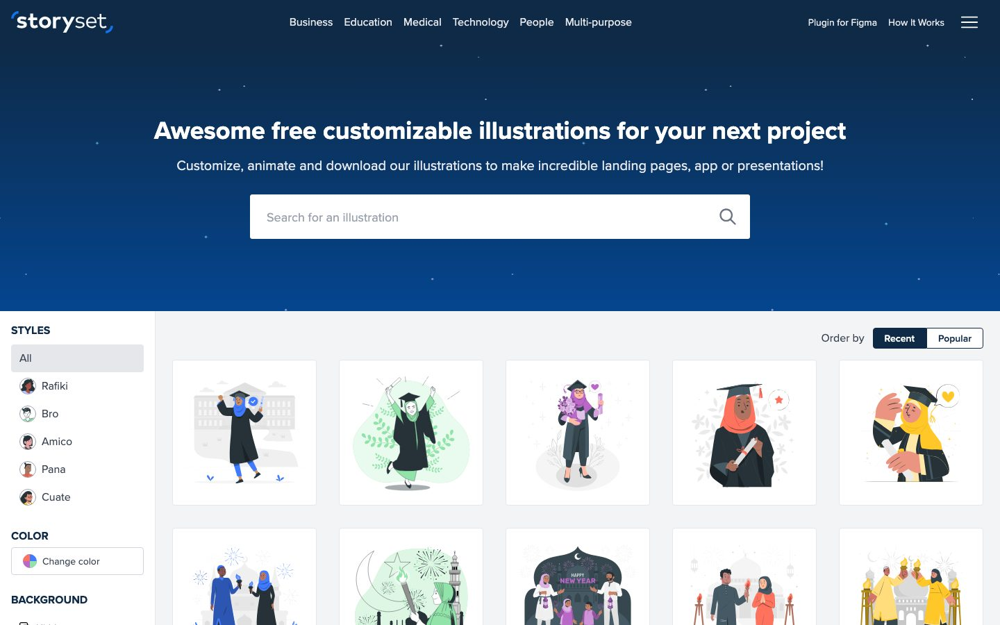

`storyset.com` — Freepik-owned library of customisable, **animatable** SVG illustrations in five recurring
character styles (Rafiki, Bro, Amico, Pana, Cuate). An online editor swaps colors, toggles layers and
animates scenes before export.
- **Free:** Browse, recolor, animate and download (SVG/PNG static; HTML/GIF/MP4 animated) — **but attribution to Storyset is mandatory.**
- **Paid:** A Freepik/Flaticon premium licence removes attribution. Third-party sources cite ~$5–59/mo; **`unverified`** — `storyset.com/pricing` 404s.
- **Subscription needed?** **Only to drop the attribution badge** — which is, in practice, the whole reason people pay.
- **License:** Freepik License — free for personal and commercial use *if* visibly attributed with a link. No reselling, redistributing or trademarking the artwork.
- **API:** None found.
- **Best for:** Consistent-character illustrations for onboarding, heroes and empty states.
- **Watch-out:** That attribution requirement is easy to forget and easy to breach.

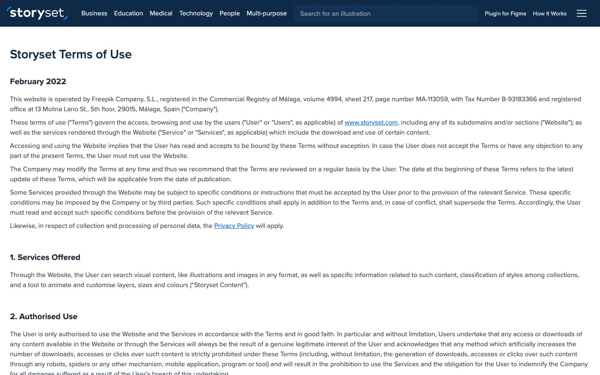

#### unDraw
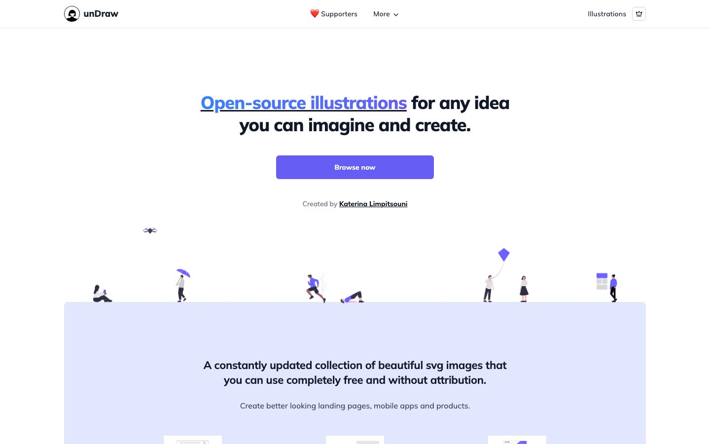

`undraw.co` — Katerina Limpitsouni's single-artist open illustration set in one flat minimalist style,
with **one-click recoloring** to any brand palette.
- **Free:** ✅ The entire library, fully recolorable, **no signup, no attribution**.
- **Paid:** unDraw Plus (`plus.undraw.co`) — Supporter **$59 one-time** (one year of access); Supporter + Videos **$79 one-time**. Unlocks animated scenes, custom palettes, cover images, AI carousel/poster/screenshot tools and a video editor.
- **Subscription needed?** **No.** Static illustrations — the actual product — are free. Plus is only for the motion/video tooling.
- **License:** Open licence, **explicitly no attribution required**, free for personal and commercial projects. The sole restriction: don't clone unDraw as a competing set.
- **API:** None found.
- **Best for:** The lowest-friction, legally simplest illustrations available.
- **Watch-out:** None. This is the cleanest licence in the illustration category.

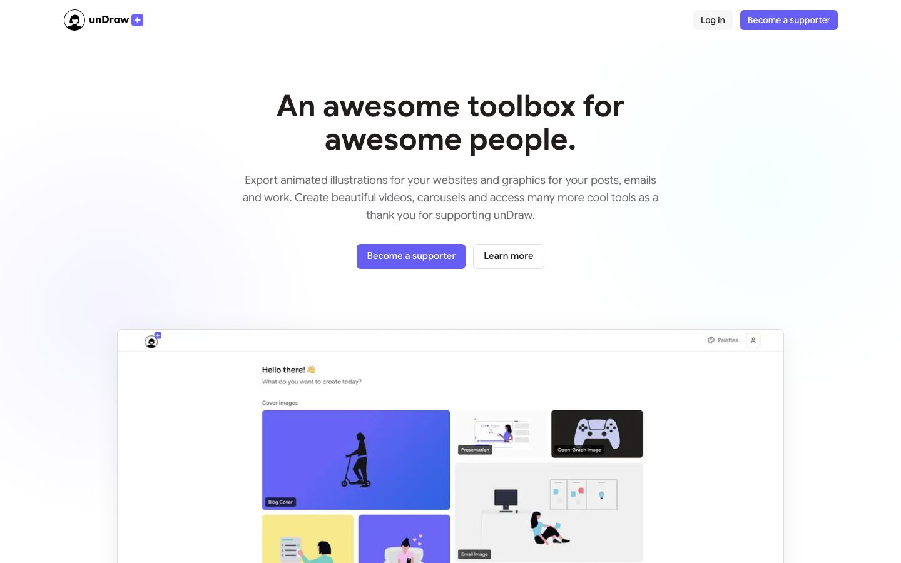

#### Blush
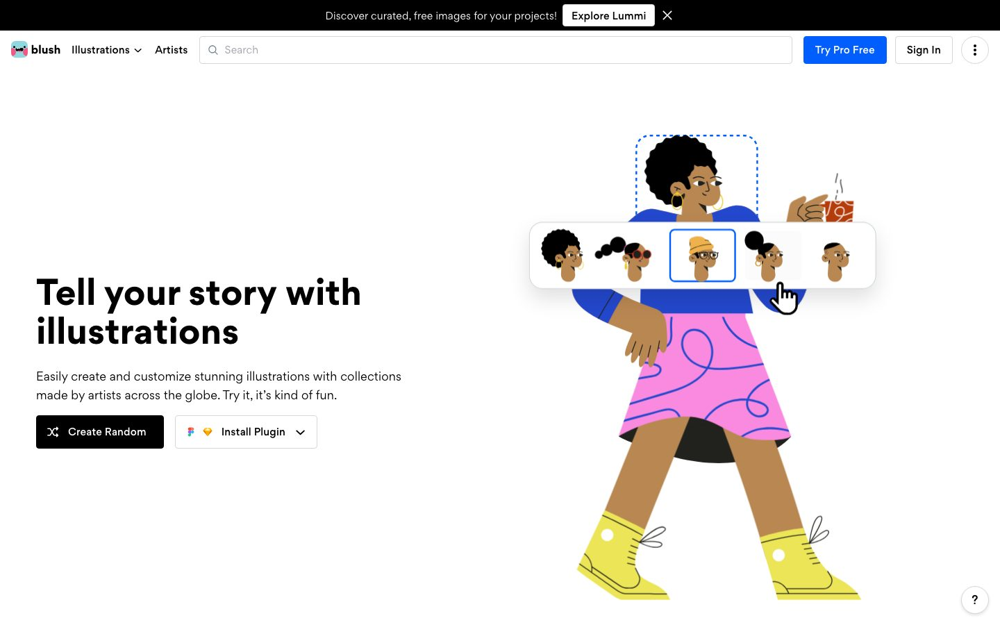

`blush.design` — Component-based platform aggregating collections from many independent artists; you
mix and match body parts, props and backgrounds. Figma and Sketch plugins.
- **Free:** Unlimited **PNG** downloads from a **limited subset** of collections.
- **Paid:** Pro ~**$12/mo or $96/yr** `unverified` (confirmed via search, not first-party — the plans page didn't render numerics to fetch). Unlocks the full library, **SVG/vector export** and print-resolution PNG.
- **Subscription needed?** **Yes if you need vectors** — free is PNG-only on a partial library.
- **License:** Every graphic usable for personal and commercial purposes **without attribution**.
- **API:** None found.
- **Best for:** Assembling on-brand custom illustrated scenes from parts.
- **Watch-out:** Price is high-confidence but not first-party verified.

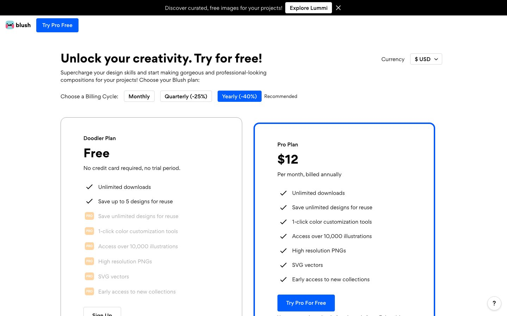

#### Lummi
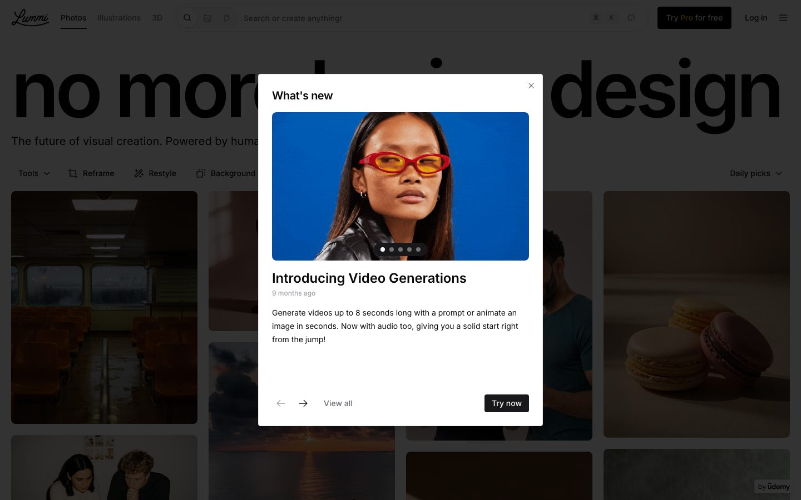

`lummi.ai` — AI-generated (plus some human) stock photos, illustrations and 3D assets, with built-in AI
editing: reframe, restyle, background removal, upscaling.
- **Free:** Everything not flagged "Pro" is free to browse and download; some AI credits included (exact count `unverified`).
- **Paid:** Pro **$15/mo**, or **$10/mo billed annually** → entire library **without watermark**, ultra-res upscaling, background removal on any image, 60 AI credits/mo, image-to-video coming.
- **Subscription needed?** **Yes for Pro-flagged assets** — they carry watermarks otherwise.
- **License:** ✅ Genuinely permissive — **no attribution, no permission needed**, unlimited commercial and personal use including client work. You may **not** resell Lummi images as-is, bundle them into a competing stock service, or claim ownership of the original even after editing.
- **API:** REST API with Bearer auth at `lummi.ai/developers/api-reference`; key requires an application. Rate limits `unverified`.
- **Best for:** AI stock imagery with a licence that doesn't fight you.
- **Watch-out:** The free/Pro split inside the library isn't obvious until you hit a watermark.

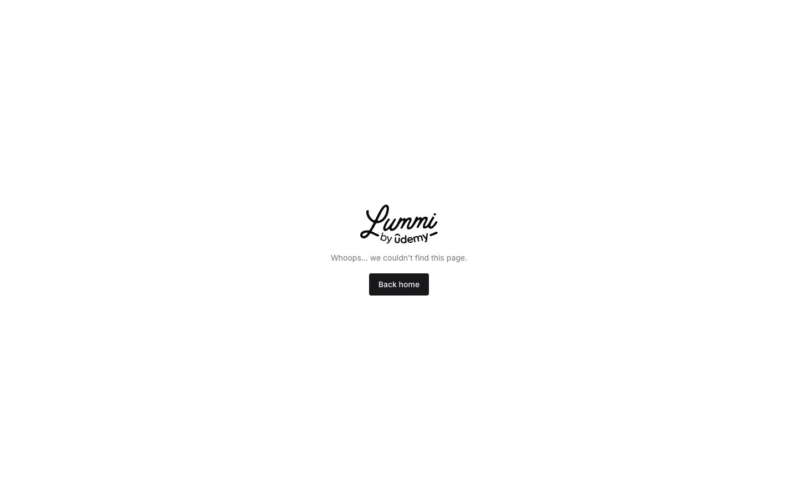

#### Whirrls
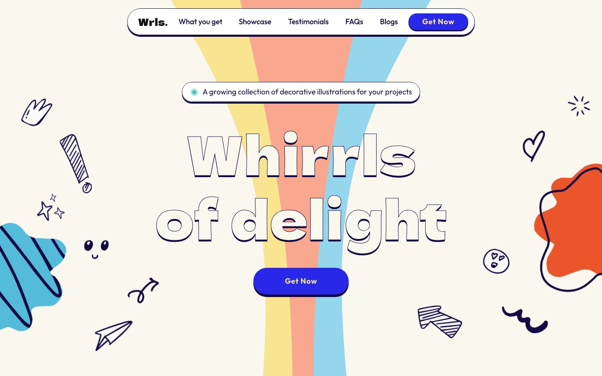

`whirrls.com` — **A single asset pack, not a library**: hand-drawn decorative swirls, blobs, smiley icons
and organic shapes as Figma/SVG files. Reported 800–1,000+ elements plus 100+ icons.
- **Free:** A subset ships as a free Figma Community file.
- **Paid:** One-time purchase for the full pack. ⚠️ **Price `unverified`** — `whirrls.com/pricing` 404s and no third-party figure was confirmable.
- **Subscription needed?** Not a subscription — one-time.
- **License:** ⚠️ **`unverified`** — no licence or terms page could be located.
- **API:** None.
- **Best for:** Playful hand-drawn decorative accents.
- **Watch-out:** **Both price and licence are unknown.** Confirm directly before any commercial use.

#### World in Dots
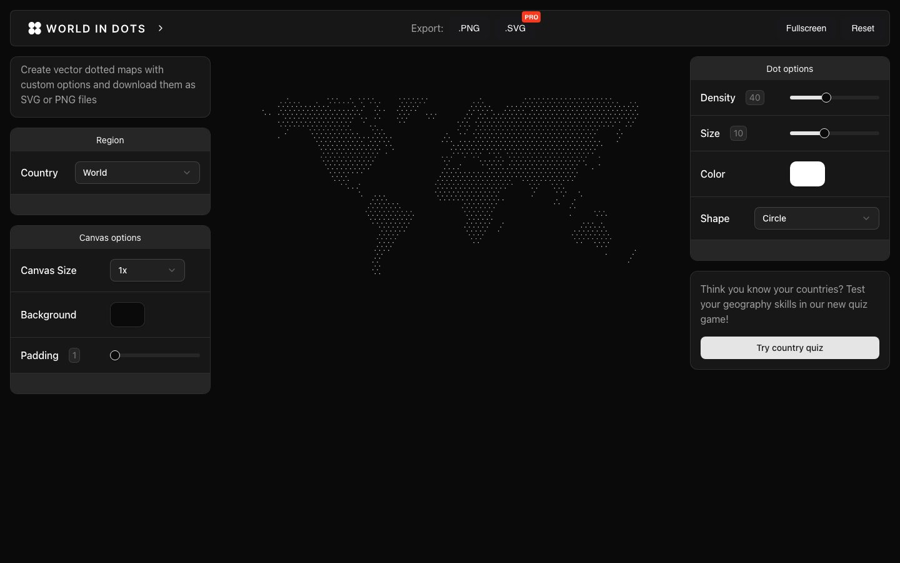

`worldindots.com` — A **generator**, not a clip-art library: stylised dot-density maps. Pick a
country/continent/globe region, tune dot density, size, color and shape, export PNG or SVG.
- **Free:** Reported 100% free with no paywall on generation or export — `unverified` first-party (the homepage is JS-rendered and returned only "Loading…" to fetch).
- **Paid:** None found; `unverified` whether any exists.
- **Subscription needed?** Not needed, on available evidence.
- **License:** ⚠️ **`unverified`** — no terms page found; commercial usability of exports is undocumented.
- **API:** None.
- **Best for:** Stylised dot-map graphics for data storytelling and presentations.
- **Watch-out:** Verify licensing manually before shipping an export commercially.

---

### Photography

#### Unsplash
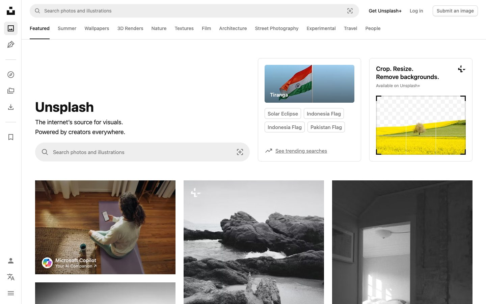

`unsplash.com` — 8.7M+ royalty-free photos from 428K+ photographers, plus the most widely used photo API
on the web. Now owned by Getty Images.
- **Free:** Full browsing and downloading of the core library. API access needs free registration — **1,000 requests/hour** on the demo tier, no approval required.
- **Paid:** **Unsplash+** for an exclusive curated photo and illustration collection. Price `unverified` — sources range $7–20/mo by billing cycle and region.
- **Subscription needed?** **No** for the free library or standard API use.
- **License:** Unsplash License — **no attribution required** (appreciated), free commercially and non-commercially. Images **cannot be sold without significant modification**, and you may not compile them into a competing photo service.
- **API:** `unsplash.com/developers`. Enterprise tier for higher volume. A public dataset download also exists.
- **Best for:** High-quality photography with a mature, well-documented API.
- **Watch-out:** Production traffic beyond 1,000 req/hr needs an Enterprise conversation.

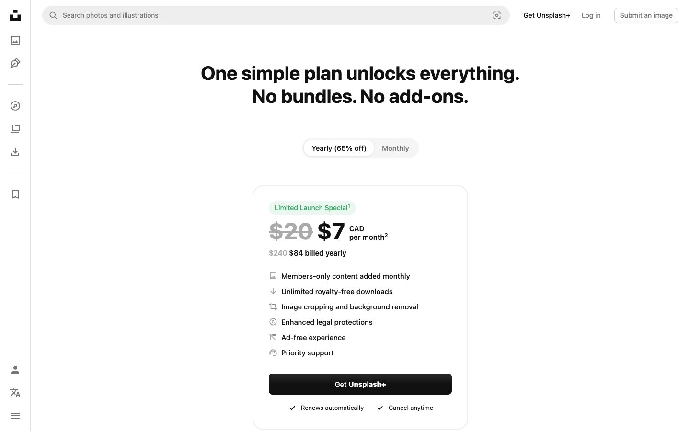

#### Pexels
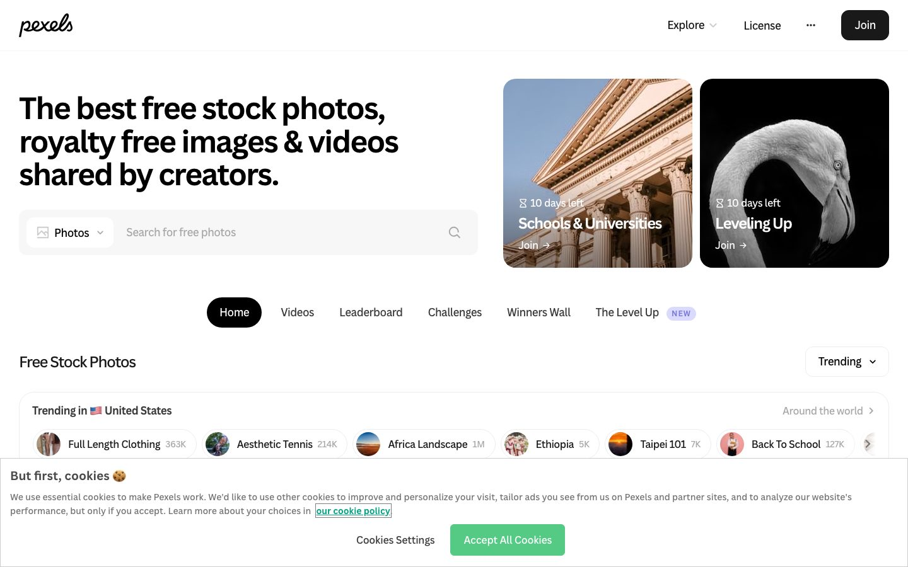

`pexels.com` — Large free stock **photo and video** library from a contributor community, serving 15B+
API requests per month.
- **Free:** Unlimited downloads of photos and videos for commercial use, **no signup** to browse or download.
- **Paid:** Free — **no paid tier exists.**
- **Subscription needed?** Not needed.
- **License:** Pexels License — **attribution optional**, commercial use fully permitted (websites, e-commerce, print, templates for sale). You may **not** sell unaltered copies as a standalone product, redistribute on other stock platforms, use identifiable people offensively or as an implied endorsement, or use images as trademarks/logos.
- **API:** Free public API with a key. Default rate limits are liftable **free of charge if you show attribution**, or by contacting Pexels for high-traffic use. Explicitly forbids building a competing photo-search service or wallpaper app.
- **Best for:** Fully free, commercially safe photography with an API that scales without payment.
- **Watch-out:** Wallpaper apps and photo-search clones are off-limits by ToS.

#### Pixabay
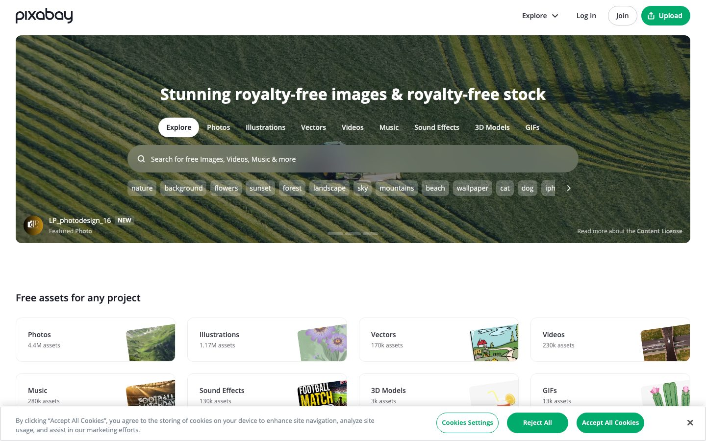

`pixabay.com` — Large free media library spanning photos, illustrations, vectors, video **and music**.
- **Free:** The full library, no attribution required.
- **Paid:** Free — no paid tier.
- **Subscription needed?** Not needed.
- **License:** Pixabay Content License — no attribution needed. **But:** content containing recognisable trademarks/logos/brands can't be used commercially "in relation to goods and services"; nothing may be printed on physical merchandise for sale; nothing may be redistributed or sold "on a standalone basis" (unmodified, no creative effort added); no immoral/illegal use of recognisable people; no use as a trademark or business name.
- **API:** ⚠️ **The API rules contradict the download rules.** Free API, **100 requests/60s per key**, results **must be cached 24 hours**, systematic mass downloads and permanent hotlinking are forbidden (download to your own servers), full-resolution URLs need **separate approval**, and **attribution to Pixabay is required** when displaying API results — even though manual downloads need none.
- **Best for:** Broad free media at scale, if you respect the API rules.
- **Watch-out:** That attribution/caching mismatch is a genuine trap for integrators.

#### Cosmos
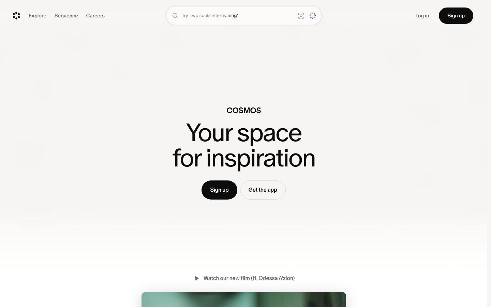

`cosmos.so` — Visual discovery and mood-boarding that **aggregates and indexes images from across the
web** for search, collection and reference. It is **not** a stock licensor and hosts no original photography.
- **Free:** Browsing, search (text, color, visual similarity) and personal collections; signup appears required for full features.
- **Paid:** `unverified` — no pricing page reachable.
- **Subscription needed?** `unverified` — likely collection or team limits.
- **License:** ⚠️ **There is no blanket answer, and that's the point.** Rights depend entirely on each image's **original source**, not on Cosmos. Its terms page could not be fetched to confirm anything further.
- **API:** None found.
- **Best for:** Mood-boarding and visual research.
- **Watch-out:** 🔴 **Nothing on Cosmos is pre-cleared.** Trace every image to its origin before use — this is the single riskiest source in the catalogue.

---

### 3D & Graphics

#### Spline
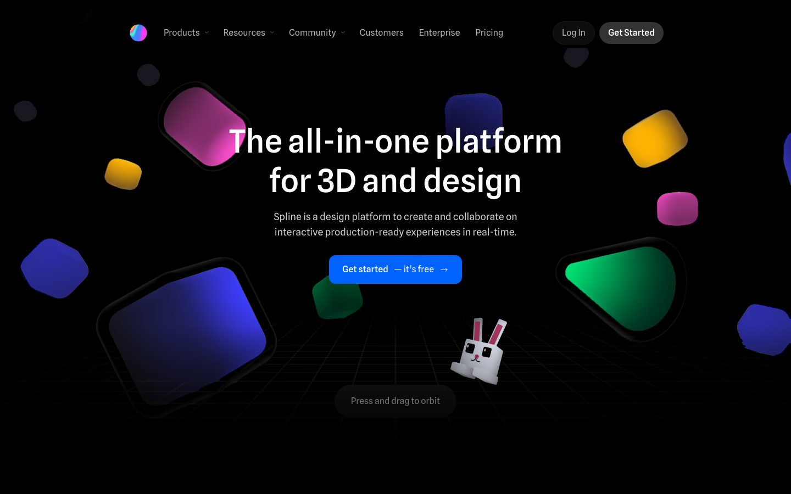

`spline.design` — Browser-based 3D design tool with AI features for interactive 3D/2D scenes, plus a
community "Spline Library" of remixable models, materials and icons.
- **Free:** Limited personal files, unlimited viewers, **watermarked web exports**, Spline Library access, 2,000 AI credits/mo.
- **Paid:** Hobby **$12/mo** annual ($15 monthly) — unlimited files, **no watermark**, higher-res export, material/audio library, 3,000 credits. Pro **$25/mo** annual ($30 monthly) — unlimited folders, video export, multi-scene, mobile export, unlimited variables/APIs/webhooks, no embed watermark. Max **$60/mo** annual — 10,000 credits, larger video export, higher MCP tool-call limits. Enterprise custom (SSO, self-host, code export).
- **Subscription needed?** **Yes for anything public** — the free tier watermarks web exports.
- **License:** Spline-created library content falls under a "Standard Commercial License" permitting remix and modification for personal and commercial use.
- **API:** Runtime API/embed system (Pro+); an **MCP server integration** is implied by the Max tier's tool-call limits.
- **Best for:** Interactive, embeddable 3D without a traditional 3D pipeline.
- **Watch-out:** The per-asset scope of "Standard Commercial License" isn't fully spelled out.

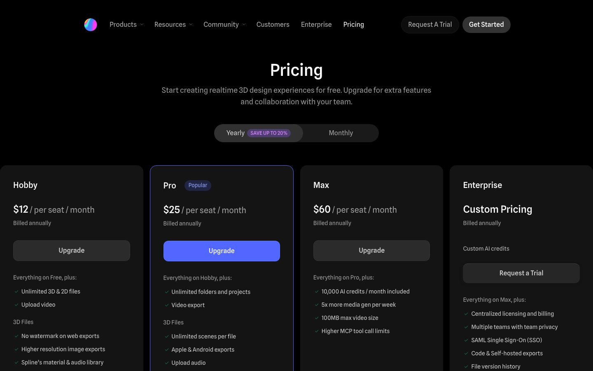

#### Three.js Examples
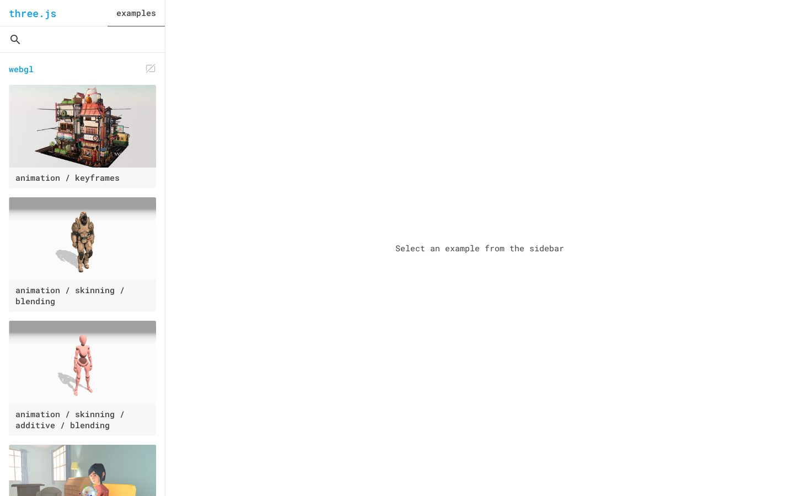

`threejs.org/examples/` — The official example gallery for Three.js. These are **runnable code demos**
whose source you read and copy, not downloadable graphics.
- **Free:** Entirely — library, docs and every example's source.
- **Paid:** Free — no commercial product exists.
- **Subscription needed?** Not needed.
- **License:** **MIT** (confirmed from the repository LICENSE) — free use, modification and redistribution, commercial or not, retaining the notice.
- **API:** npm `three`; source at `github.com/mrdoob/three.js`. No rate limits — it's a library, not a service.
- **Best for:** Learning and reusing WebGL patterns — particles, shaders, post-processing, physics.
- **Watch-out:** Expect to write code, not download an asset.

#### Womp
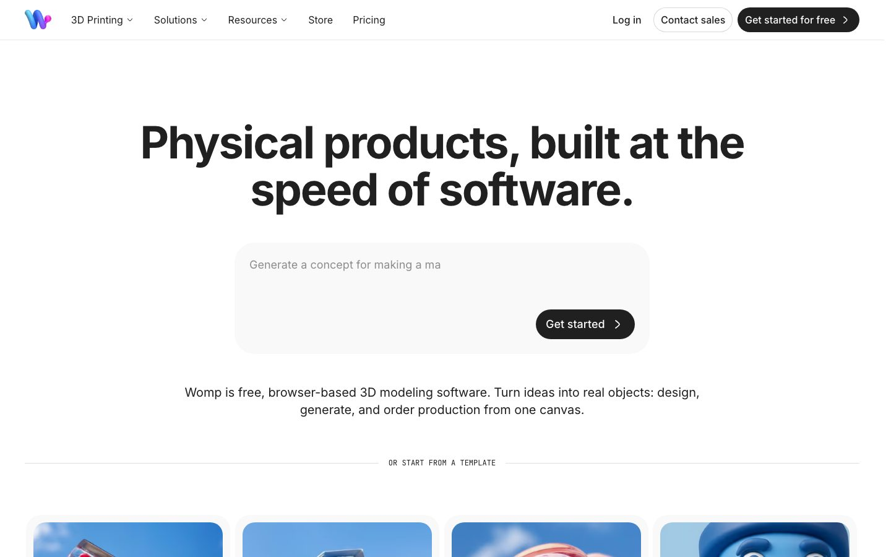

`womp.com` — Browser-based, beginner-friendly 3D modelling with AI-assisted generation, a materials
library and 3D-printing integration.
- **Free:** "Starter", free forever — Full-HD image/video export plus limited 4K, standard materials, **300 AI credits/day**.
- **Paid:** Pro **$9.99/mo** billed annually ($119.88/yr, ~25% under monthly) — full 4K image and 4K/60fps video, 500+ "Super Materials" and pro asset library, 12,000 credits/mo, 10% off print orders. Team **$19.99/seat/mo** annual — shared asset library, 15,000 credits/seat. Enterprise from $119.99/seat/mo — chrome, titanium, full-color print materials.
- **Subscription needed?** **Yes for 4K export** and the full materials library.
- **License:** ⚠️ **`unverified`** — no explicit commercial-use statement found for exported models or materials.
- **API:** None found.
- **Best for:** Approachable in-browser 3D with a route to physical printing.
- **Watch-out:** Confirm commercial rights before shipping exports.

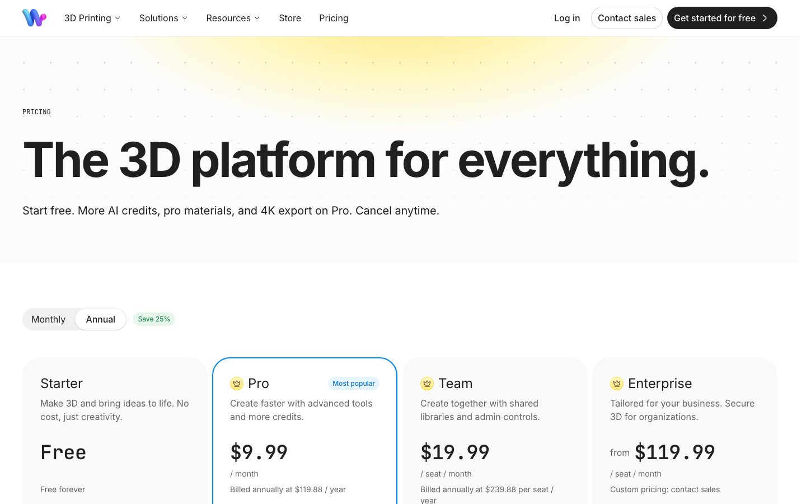

#### Pixcap 🔴 **OFFLINE**
> **No screenshot — the site could not be reached.**
>
> `pixcap.com` — browser-based 3D graphic/mockup generator with ready-made 3D assets, characters and scenes.
>
> **Status, verified 21 Aug 2026:** the domain is registered (AWS Route 53 nameservers respond, SOA present)
> but has **no A record** — it does not resolve from the system resolver or from `8.8.8.8`, and both
> Playwright (`ERR_NAME_NOT_RESOLVED`) and `curl` fail. The independent research pass hit the same DNS
> failure, so this is not a transient local issue.
>
> **Historical pricing** (third-party, never first-party confirmed): free tier with 5 HQ image exports/mo,
> commercial licence but **watermark + required attribution**; Pro $10/mo annual (50 HQ images, 10 HQ videos,
> no attribution); Elite $20/mo annual (unlimited images, 30 videos, 3D file export).
>
> **Action:** remove from the catalogue, or re-verify before the next release.

---

### Mockups

#### Shots
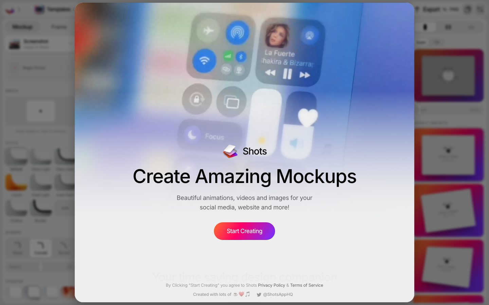

`shots.so` — Browser-based device-mockup and screenshot-beautification tool (iPhone, Android, iPad,
desktop) with animation/video export, magic backgrounds and VFX filters.
- **Free:** Device mockup library and PNG/JPG export, one click, no signup.
- **Paid:** ~$8/mo and ~$12/mo tiers `unverified` (its `/pricing` URL 404s; figures are third-party). The higher tier unlocks WebP export plus premium effects and animations.
- **Subscription needed?** Only for WebP and premium motion effects — standard mockups are free.
- **License:** ⚠️ **`unverified`.** The ToS never addresses commercial rights for generated mockups or device-frame trademarks; it only forbids scraping Shots' own data.
- **API:** None; scraping and bulk download explicitly forbidden.
- **Best for:** Fast animated app screenshots for App Store and social.
- **Watch-out:** ⚠️ **No stated policy on Apple/Google trademarks in device frames** — a real risk for paid ads or resold assets.

#### Mockuuups Studio
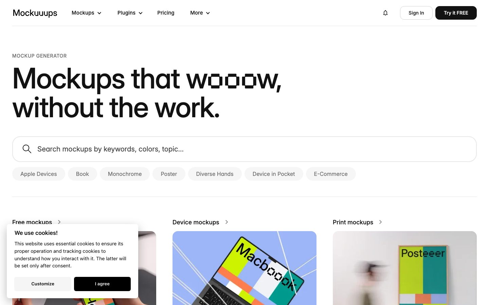

`mockuuups.studio` — Large mockup-scene library (device, print, apparel, packaging) with a web app plus
Figma and Adobe Express plugins for dropping designs into photorealistic scenes.
- **Free:** A limited collection "for personal projects, students, those who just want to try it out". Attribution may be expected; exact terms `unverified`.
- **Paid:** Professional **$15/mo or $120/yr** (40% saving) → **5,300+ mockups**, unlimited 4K exports, **commercial licence**, Figma plugin, Adobe Express add-on, website screenshot capture. Team **$20/user/mo or $120/user/yr** adds SAML SSO, unified billing, priority support. One-time per-mockup purchase also available in the desktop app.
- **Subscription needed?** **Yes for the library and for commercial rights.**
- **License:** Commercial Use Licence with Professional/Team covers client and personal work — but you **cannot resell mockups as stock**. Use them to present your designs, not to redistribute the templates.
- **API:** None found.
- **Best for:** High-volume photorealistic scenes across device, print and apparel.
- **Watch-out:** Free-tier attribution wording is unconfirmed.

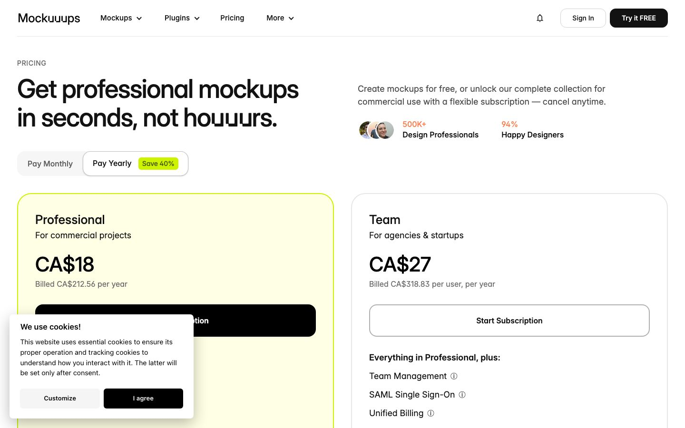

#### Angle
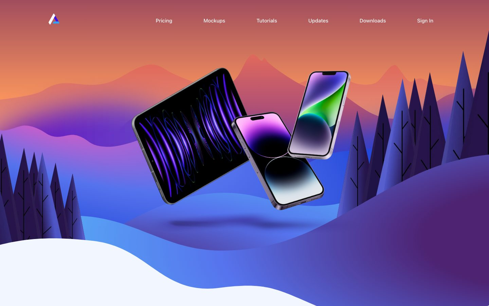

`angle.sh` — Device-mockup library and Figma/Sketch/XD plugin focused on Apple and mobile hardware.
- **Free:** Sample mockups and plugin access — ⚠️ **personal use only.**
- **Paid:** Full Library **$79** (includes one year of upgrades) → 1,000+ mockups **and commercial use**. Lifetime **$149** one-time → everything plus unlimited future upgrades.
- **Subscription needed?** **Not a subscription, but yes, you must pay to use it commercially at all.**
- **License:** "Personal and commercial projects. 1 licence per user." **No redistribution or resale.** Team licensing is a separate conversation.
- **API:** None found.
- **Best for:** High-fidelity Apple/mobile mockups for product marketing and store assets.
- **Watch-out:** 🔴 Using the **free tier in client work is a licence breach.** Price rises as the library grows.

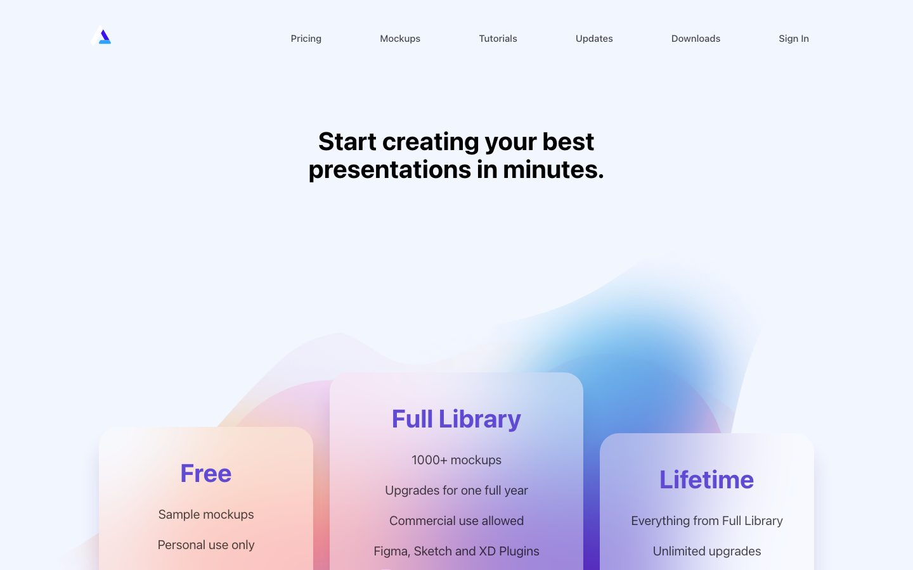

#### Rotato
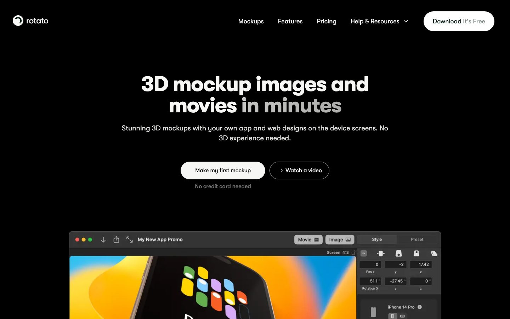

`rotato.app` — Mac app for **animated 3D device-mockup videos**, aimed at App Store and product-launch marketing.
- **Free:** 🔴 **None** — Rotato is a paid desktop app.
- **Paid:** **One-time purchases, explicitly "No monthly fees. No yearly fees."** Basic — all phone mockups, no templates, 6 months of updates, 4K H.264. Standard — 30+ devices, 18 premium templates, 12 months of updates, 4K. Premium — 30+ devices, **100 premium templates**, 12 months of updates, **8K export**. ⚠️ **Exact USD figures `unverified`** — the pricing page renders client-side; an on-page testimonial cites "$99" near Basic while third parties mention $49/yr and $99/yr. Irreconcilable from the outside.
- **Subscription needed?** No subscription exists — higher tiers buy devices, templates and resolution.
- **License:** ⚠️ **`unverified`** — no commercial-use or device-trademark text found.
- **API:** None found.
- **Best for:** Cinematic animated product-launch video.
- **Watch-out:** Confirm pricing live; no trademark caveat is documented despite realistic device replicas.

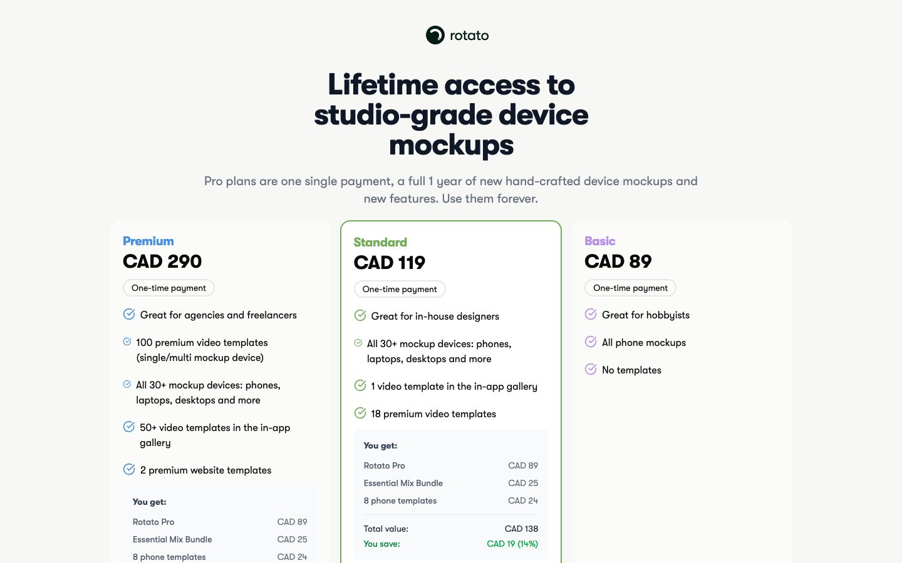

---
### Design Systems

#### Impeccable Style
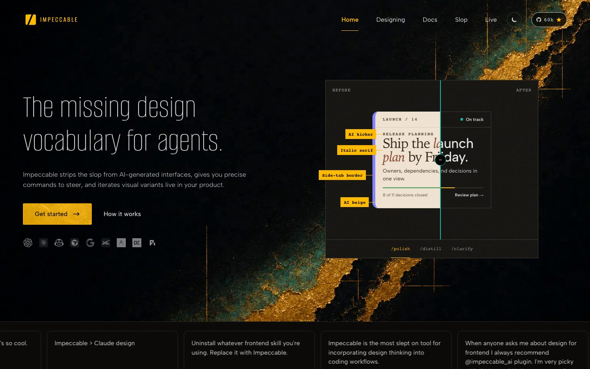

`impeccable.style` — Open-source **design skill for AI agents** (Claude Code, Cursor, Copilot): 23
commands, 59 anti-pattern checks, and reference guides for typography, color, spacing, motion and
interaction. By Paul Bakaus.
- **Free:** 100% free, no signup. npm install, Chrome extension, marketplace plugins.
- **Paid:** Free — no paid tier.
- **Subscription needed?** Not needed.
- **License:** **Apache-2.0**, attribution per licence terms, commercial use permitted.
- **API:** `npx impeccable install`; repo at `github.com/pbakaus/impeccable`; Chrome Web Store extension.
- **Best for:** Making an agent design-aware, and catching AI-generated interface flaws.
- **Watch-out:** None.

#### Styles Refero
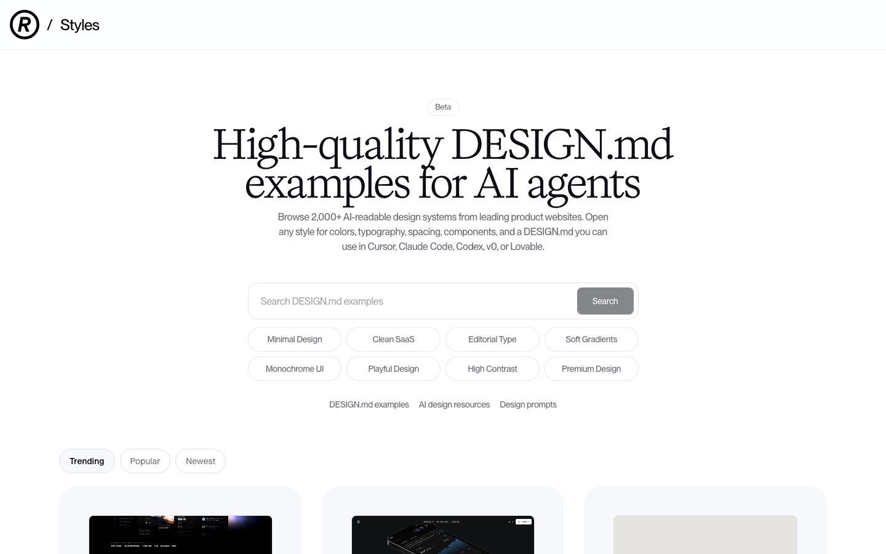
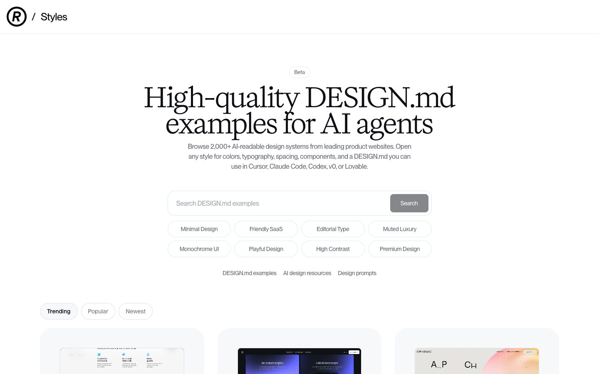

`styles.refero.design` — 2,000+ **AI-readable design systems** in `DESIGN.md` format, extracted from
shipped products (Apple, Linear, AuthKit…): colors, typography, spacing, components, for consumption by
Cursor, Claude Code, v0 and Lovable.
- **Free:** Complete access, no signup, no download needed — it runs in the browser.
- **Paid:** Free. *(The broader Refero platform has paid Pro tiers; `styles.` itself is free.)*
- **Subscription needed?** Not needed for Styles.
- **License:** ⚠️ **`unverified`** — described as free for personal and commercial projects, but no formal terms are published and the systems are extracted from real products.
- **API:** **Refero MCP server** for Claude and other assistants; community MCP packages exist.
- **Best for:** Giving an agent real design taste before it starts building.
- **Watch-out:** Contact `mike@refero.design` about commercial terms on extracted systems.

#### Brandfetch
> **No screenshot** — Brandfetch serves a Cloudflare interstitial to headless browsers. A "Just a moment…"
> placeholder would be worse than none. The site is live in a normal browser.

`brandfetch.com` — Brand-data API platform: logos, colors, fonts, firmographics and company metadata,
across a Brand API, Logo API and Brand Search API with real-time indexing.
- **Free:** **Logo API free to 500K requests/month** with **no attribution required**; Brand Search API free to 500K/month; Brand API includes **100 free requests**.
- **Paid:** Brand API from **$99/month** (20% off annual), overages **$0.10 per brand call**. 20% startup/nonprofit discount for 12 months. Enterprise custom.
- **Subscription needed?** **The logo endpoints are genuinely free at real scale** — you only pay once you need structured brand data beyond 100 calls.
- **License:** ⚠️ Commercial restrictions apply — you may **not** replicate Brandfetch's core UX or redistribute brand logos to end users.
- **API:** REST at `brandfetch.com/developers`, free account required, JS and Python SDKs.
- **Best for:** Programmatically embedding logos and company brand data.
- **Watch-out:** "Redistribute logos to end users" is vague and central — clarify with sales for anything logo-facing.

#### Design Systems Repo
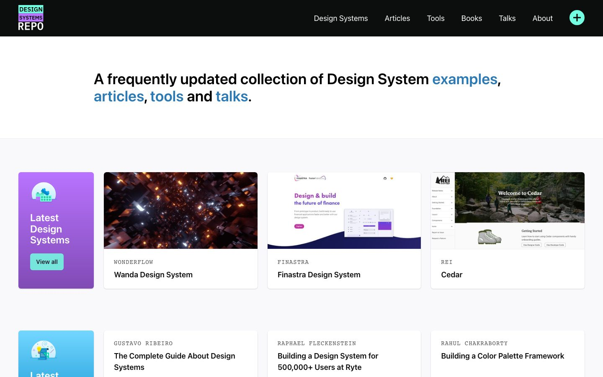

`designsystemsrepo.com` — Hand-curated collection of design system examples, articles, books, talks and
tools, maintained by Jad Limcaco.
- **Free:** 100% free, no signup.
- **Paid:** Free — no paid tier.
- **Subscription needed?** Not needed.
- **License:** ⚠️ **`unverified`** — no licence statement on the site or its repo (`jadlimcaco/design-systems-repo`).
- **API:** None; manual curation. Contributions by PR.
- **Best for:** Researching how real companies structure their design systems.
- **Watch-out:** Ask the maintainer before commercial reuse.

#### Startups Gallery
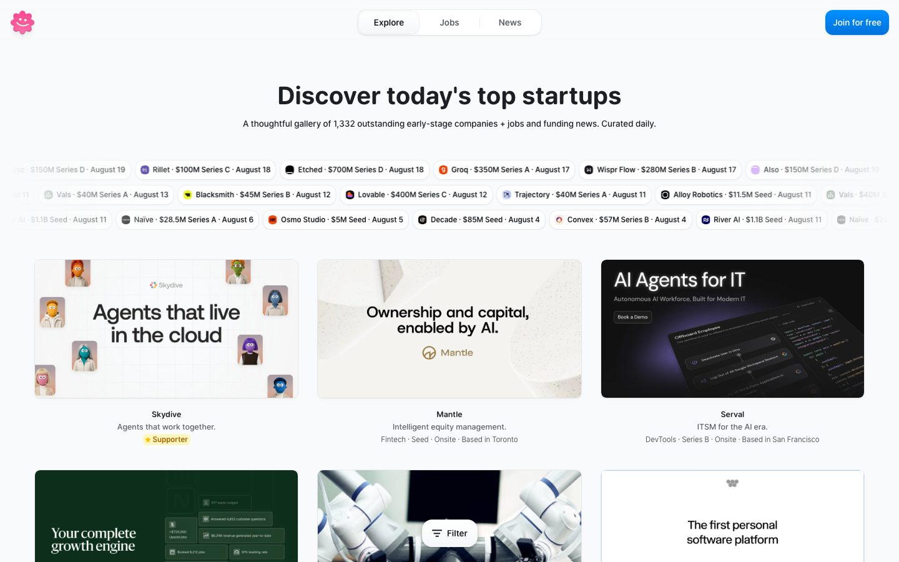

`startups.gallery` — Directory of 1,332+ early-stage startups (YC, Sequoia, a16z), plus jobs and funding
news, curated daily by Louis Albertini and Gonzalo García Paz.
- **Free:** All profiles and jobs; free human-reviewed submission via Tally; weekly newsletter.
- **Paid:** Free — sponsorships exist, but it is not pay-to-list.
- **Subscription needed?** Not needed.
- **License:** `unverified` — public directory, no published terms.
- **API:** None; filter-based browsing only.
- **Best for:** Tracking early-stage startups, funding and jobs.
- **Watch-out:** ⚠️ **Category mismatch** — this is a startup/jobs directory, not a visual design resource. Consider whether it belongs in the Design Browser at all.

---

### Components

#### Base UI
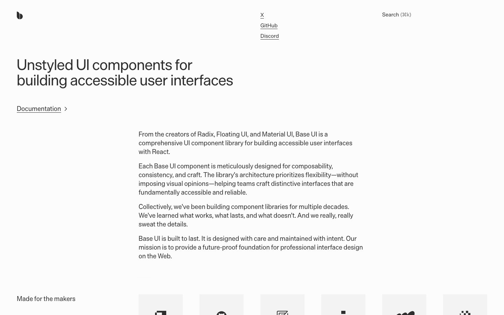

`base-ui.com` — Headless React primitives (~30) from the **MUI team working with the original creators of
Radix and Floating UI** — effectively the successor to both Radix Primitives and MUI's old Base package.
- **Free:** The entire library.
- **Paid:** Free — no paid tier. · **License:** **MIT** (`mui/base-ui`).
- **API:** npm `@base-ui/react` (v1.7.0, 4 Aug 2026). Ships an `llms.txt` for AI assistants. No CLI or MCP of its own.
- **Best for:** Radix-level accessible primitives with well-resourced backing going forward.
- **Watch-out:** Younger than Radix/React Aria; the API is still settling post-1.0, so expect more breaking changes. React only.

#### shadcn/ui
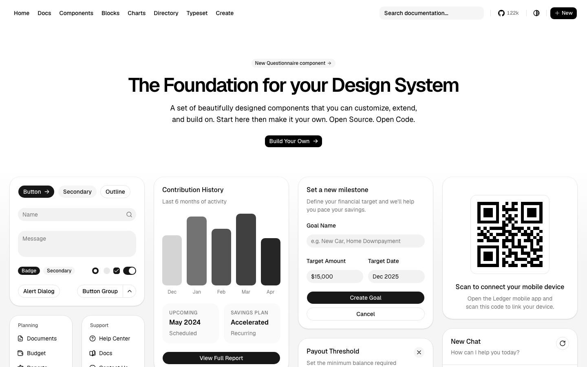
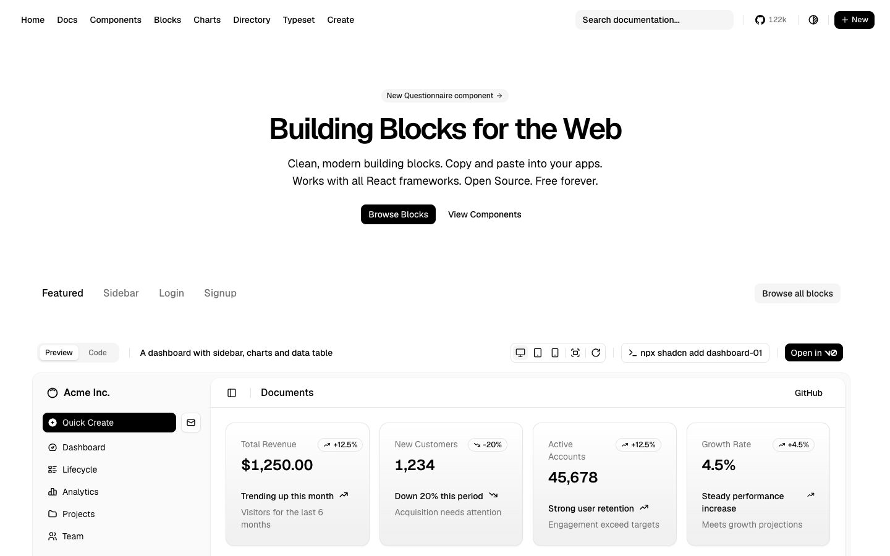

`ui.shadcn.com` — **Not a dependency.** A CLI plus open registry of copy-paste component source (built on
Radix/Base UI and Tailwind) that you own and version in your own repo. By shadcn, now at Vercel.
121,749 GitHub stars.
- **Free:** The whole registry and CLI. · **Paid:** Free — no official paid tier. · **License:** **MIT**.
- **API:** npm `shadcn` (v4.18.0, 13 Aug 2026). `npx shadcn@latest init` / `add`. **Official MCP server:** `npx shadcn@latest mcp init --client <claude|cursor|vscode|codex>`.
- **Best for:** Full ownership of component code, and the most agent-friendly workflow in this category.
- **Watch-out:** ⚠️ You own the code, so **you get no automatic upstream fixes or security patches** — updates are manual re-copies. Tightly coupled to Tailwind; the underlying primitive is shifting from Radix toward Base UI.

#### HeroUI
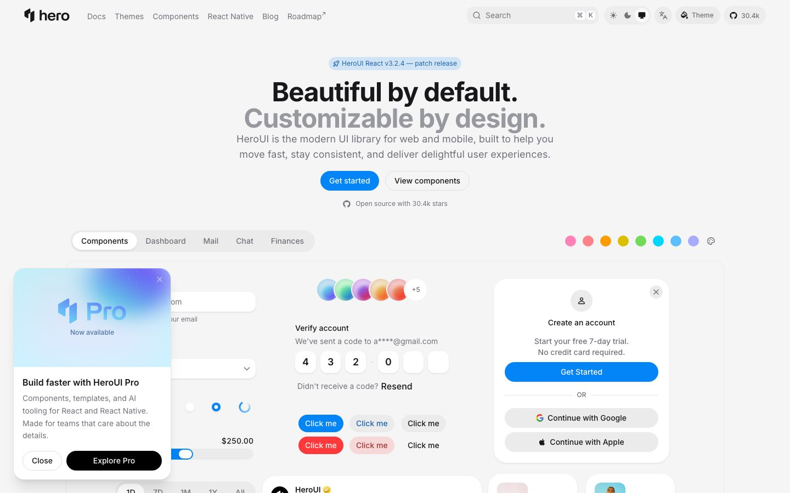

`heroui.com` *(formerly NextUI)* — Styled library of 50+ components on Tailwind + React Aria; v3 adds a
React Native line.
- **Free:** The full OSS library `@heroui/react`.
- **Paid:** **HeroUI Pro** sells premium templates and blocks as **one-time** tiers ("Web Hero", "Mobile Hero", "Super Hero", custom Enterprise). ⚠️ Exact prices **`unverified`** — the pricing page is JS-rendered and sources conflict with older tier names (Solo $249 / Startup $399 / Organization $799).
- **Subscription needed?** Only for premium templates, AI-integration examples, and Enterprise SSO/SLA/audit logs.
- **License:** **Apache-2.0** for the OSS library; Pro content under separate commercial terms.
- **API:** npm `@heroui/react` (v3.2.4, 7 Aug 2026); `heroui-cli` scaffolding. No MCP.
- **Best for:** A polished pre-styled Tailwind + React Aria set without doing your own visual design.
- **Watch-out:** The NextUI rebrand causes migration confusion; v3 introduced breaking changes.

#### Radix UI
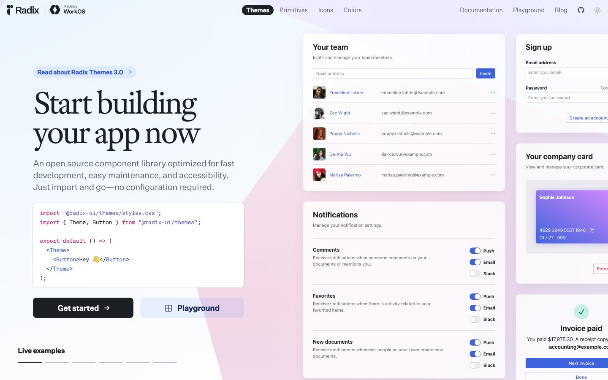

`radix-ui.com` — ~30 headless, accessible React primitives. **Now maintained by WorkOS** after the original
creators moved on. 19,194 stars.
- **Free:** Everything. · **Paid:** Free — no paid tier (Radix Themes is a free styled layer, not a paywall). · **License:** **MIT**.
- **API:** npm — scoped packages like `@radix-ui/react-dialog` (v1.1.23) or the unified `radix-ui` (v1.6.7). No official CLI/MCP; shadcn/ui wraps it.
- **Best for:** A custom design system on proven primitives, without adopting Base UI's newer API.
- **Watch-out:** ⚠️ **The original team left to build Base UI at MUI.** Watch release cadence against Base UI before starting something long-lived.

#### React Aria
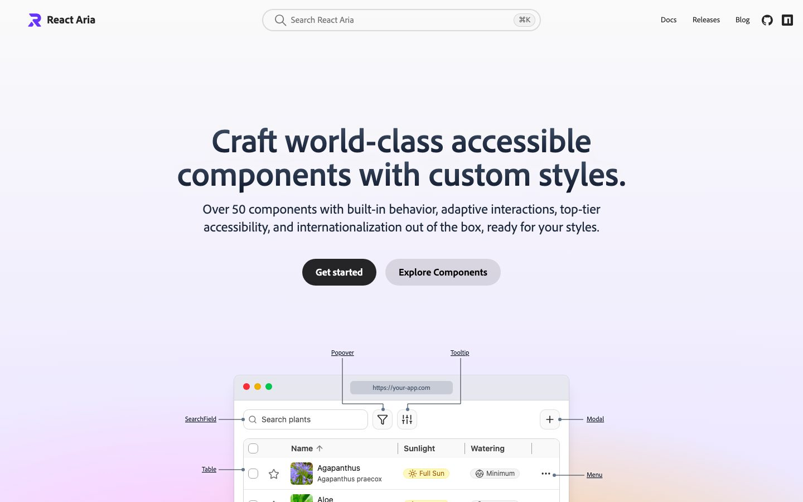

`react-aria.adobe.com` *(was `react-spectrum.adobe.com/react-aria/`)* — Adobe's headless hooks and
components covering 50+ patterns, built around **accessibility and internationalisation correctness**.
15,807 stars.
- **Free:** Entirely. · **Paid:** Free — no paid tier. · **License:** **Apache-2.0**.
- **API:** npm `react-aria` (hooks, v3.51.0) or `react-aria-components` (v1.20.0, 31 Jul 2026). No CLI/MCP.
- **Best for:** When screen readers, RTL, and keyboard/touch/pointer parity are the top priority.
- **Watch-out:** The low-level hooks API is a steep climb; composing hooks manually can cost more bundle weight than the prebuilt components. **URL has moved** — update the catalogue.

#### Headless UI
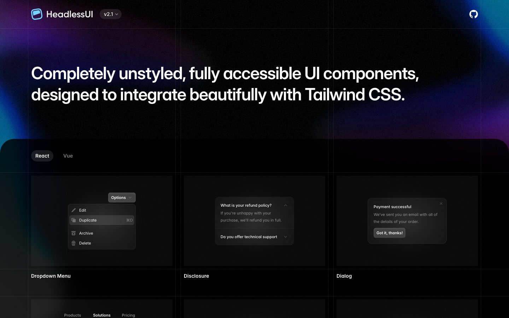

`headlessui.com` — Deliberately narrow set of ~15 headless components (Menu, Listbox, Combobox, Dialog,
Disclosure, Popover, RadioGroup, Switch, Tabs, Transition) from Tailwind Labs. React and Vue. 28,715 stars.
- **Free:** Entirely. · **Paid:** Free — Tailwind Plus (formerly Tailwind UI) is a **separate** paid product, not part of Headless UI. · **License:** **MIT**.
- **API:** npm `@headlessui/react` (v2.2.10, Apr 2026) or `@headlessui/vue`. No CLI/MCP.
- **Best for:** Needing a handful of primitives tightly paired with Tailwind, nothing more.
- **Watch-out:** ⚠️ Last push **13 Apr 2026** — noticeably slower cadence and narrower scope than Radix, Base UI, React Aria or Ark UI.

#### MUI
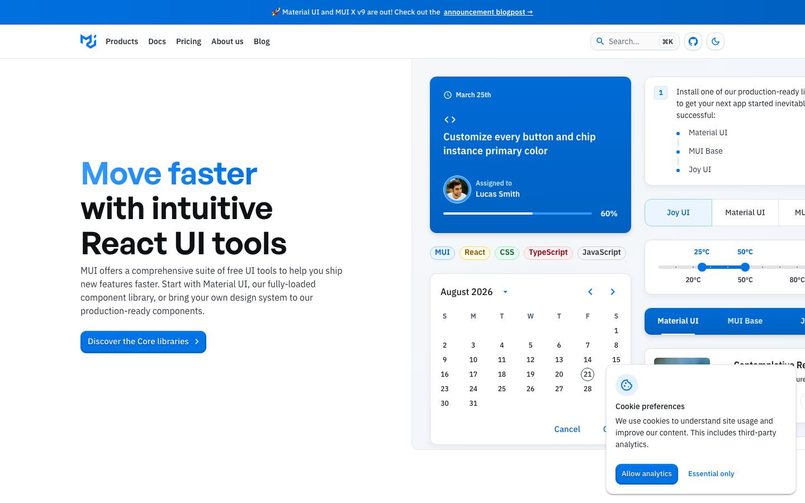

`mui.com` — Styled Material Design React library: 60+ core components, with MUI X adding advanced Data
Grid, Charts and Date/Time Pickers.
- **Free:** All of Material UI core, **MIT**.
- **Paid:** **MUI X Pro $299/yr per developer** · **Premium $599/yr** · **Enterprise $1,399/yr** (official pricing page).
- **Subscription needed?** Only for advanced Data Grid (pivoting, row grouping, Excel export), advanced Charts, premium pickers, and Enterprise SSO/support.
- **License:** MIT for `@mui/material`; MUI X Pro/Premium/Enterprise under separate commercial licence.
- **API:** npm `@mui/material` (v9.3.1, 6 Aug 2026). No official MCP.
- **Best for:** Enterprise apps wanting Material Design plus ready-made complex data grids.
- **Watch-out:** ⚠️ **MUI announced MUI X pricing/licensing changes in 2026** — check current terms before budgeting. The Material look takes real theming effort to shake off.

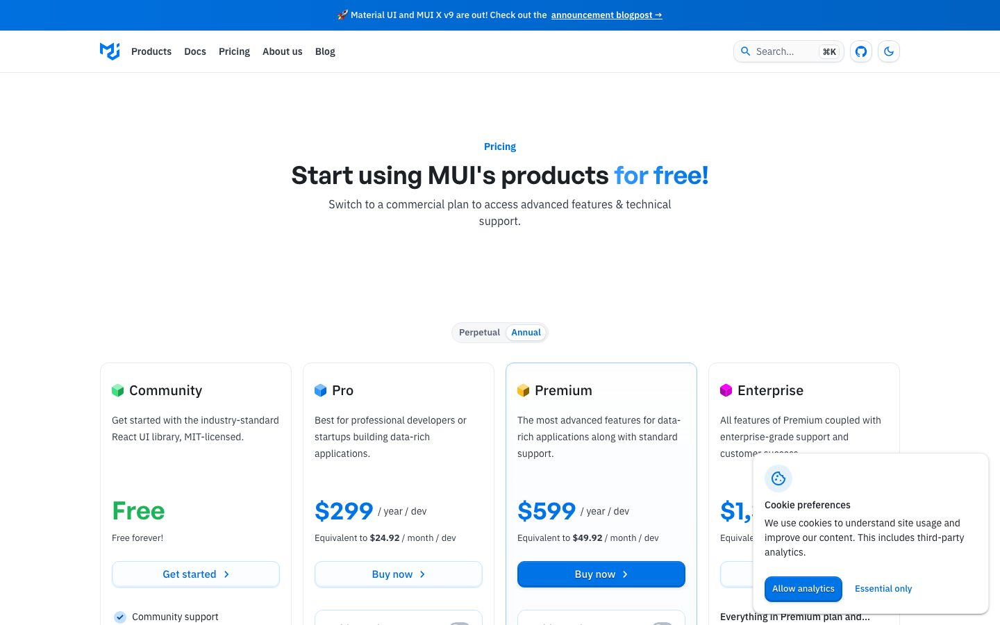

#### Mantine
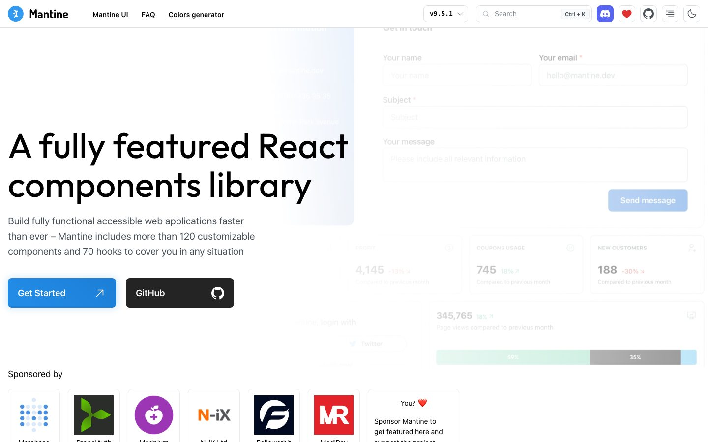

`mantine.dev` — Styled, batteries-included React library marketing **120+ components** plus hooks.
31,585 stars.
- **Free:** The entire library. · **Paid:** Free — no official paid tier (whether any community template at `ui.mantine.dev` is paid is `unverified`). · **License:** **MIT**.
- **API:** npm `@mantine/core` (v9.5.1, 2 Aug 2026) plus `@mantine/hooks` and companions. No MCP.
- **Best for:** A large component set without MUI X's per-seat, per-year licensing.
- **Watch-out:** Smaller backing than MUI means thinner formal enterprise support; **v7 → v9 in a short span** means more frequent breaking changes.

#### Chakra UI
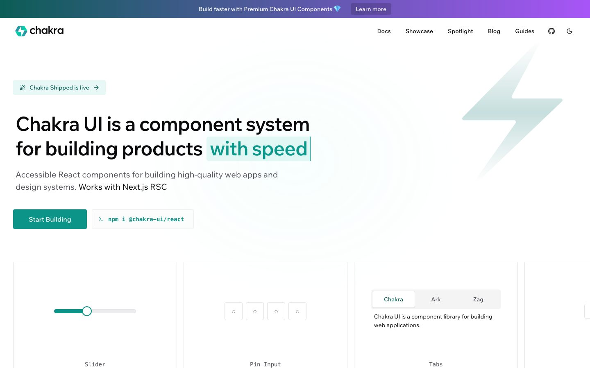

`chakra-ui.com` — Styled React library built on style props and theming; **v3 is a rewrite on top of Ark
UI + Panda CSS**. ~50 components.
- **Free:** Core `@chakra-ui/react`, **MIT**.
- **Paid:** **Chakra UI Pro** — Personal **$299** (from $349), Team **$899** (from $999), **one-time**, for 330+ page/component blocks with lifetime updates.
- **Subscription needed?** One-time, and only for prebuilt marketing/app sections.
- **API:** npm `@chakra-ui/react` (v3.36.1). No CLI/MCP.
- **Best for:** Teams who like style-prop ergonomics and would rather buy page sections than build them.
- **Watch-out:** ⚠️ **v3 was a substantial rewrite** — migrating from v2 is a genuine breaking change.

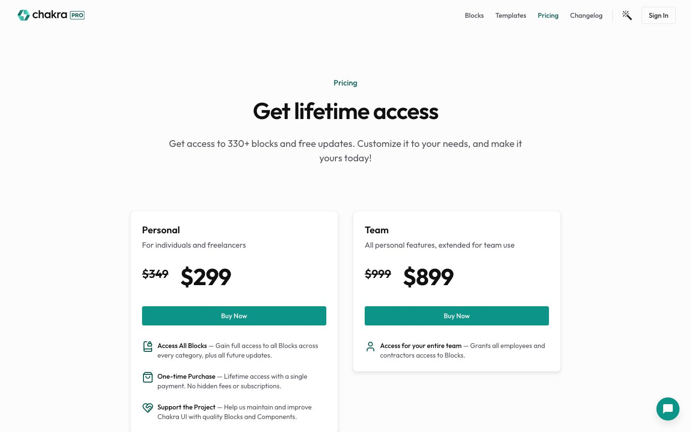

#### Ant Design
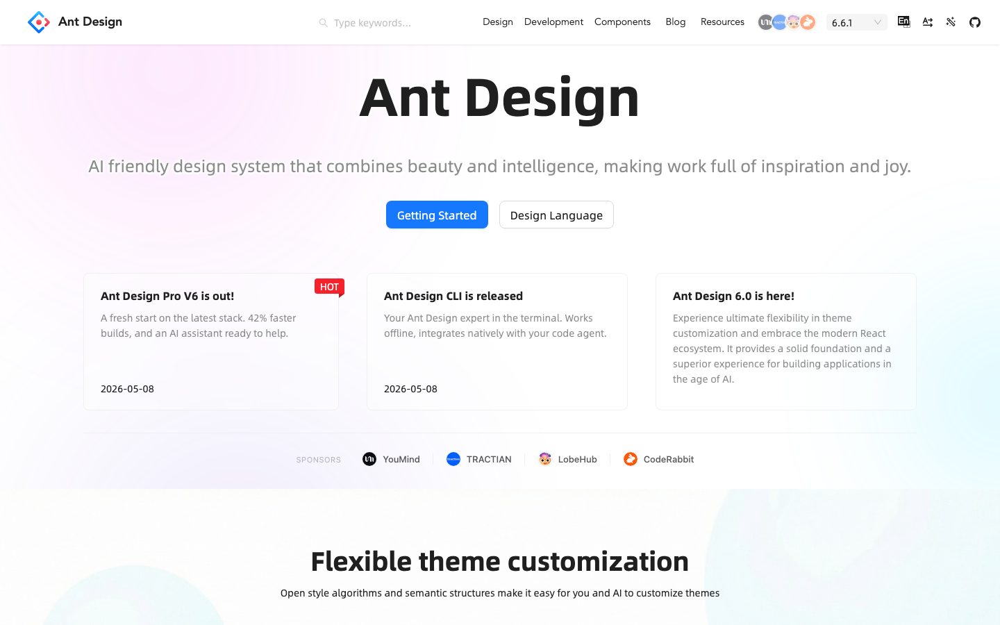

`ant.design` — Enterprise-oriented styled React library, 60+ components, from Ant Group and community.
99,133 stars.
- **Free:** ✅ **Everything, including Ant Design Pro** — despite the name, Pro is free and open source.
- **Paid:** Free — no paid tier. · **License:** **MIT**.
- **API:** npm `antd` (v6.6.1, 17 Aug 2026) plus `@ant-design/pro-components`; `ant-design-pro` scaffolding CLI. No MCP.
- **Best for:** Enterprise admin and dashboard apps.
- **Watch-out:** Strong visual identity is hard to fully reskin; **major v6 landed Aug 2026** — read the migration notes; large bundle without tree-shaking.

#### Ark UI
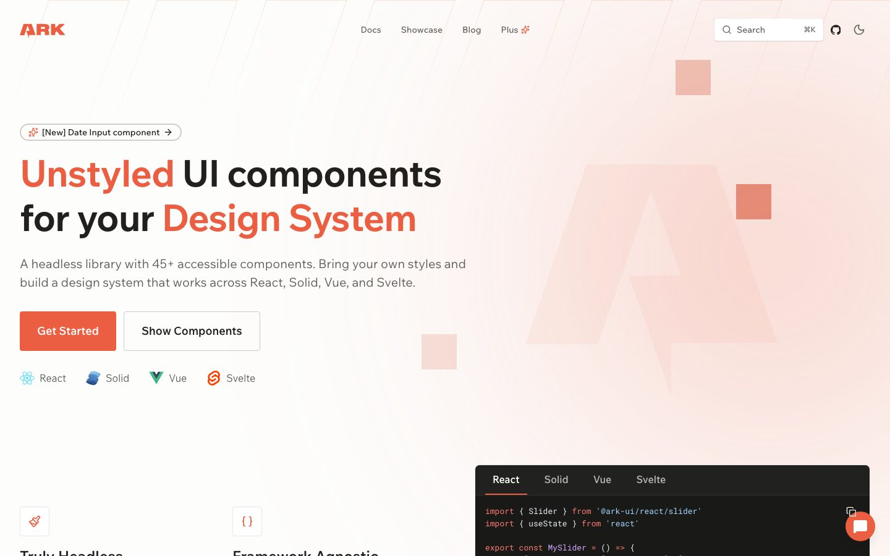

`ark-ui.com` — Headless, **multi-framework** (React, Vue, Solid, Svelte) library of 45+ components built on
**Zag.js state machines**, by the Chakra team. 5,351 stars.
- **Free:** The core library, **MIT**.
- **Paid:** **Ark Plus** — Personal **$199** (from $249), Team **$599** (from $649), **one-time**, for production-ready examples across all four frameworks.
- **Subscription needed?** One-time, only for the recipes.
- **API:** npm `@ark-ui/react` (v5.38.2) / `/vue` / `/solid` / `/svelte`. No CLI/MCP.
- **Best for:** A design system that must share identical interaction logic across React, Vue, Solid and Svelte.
- **Watch-out:** Much smaller community than Radix or React Aria; newer and less battle-tested.

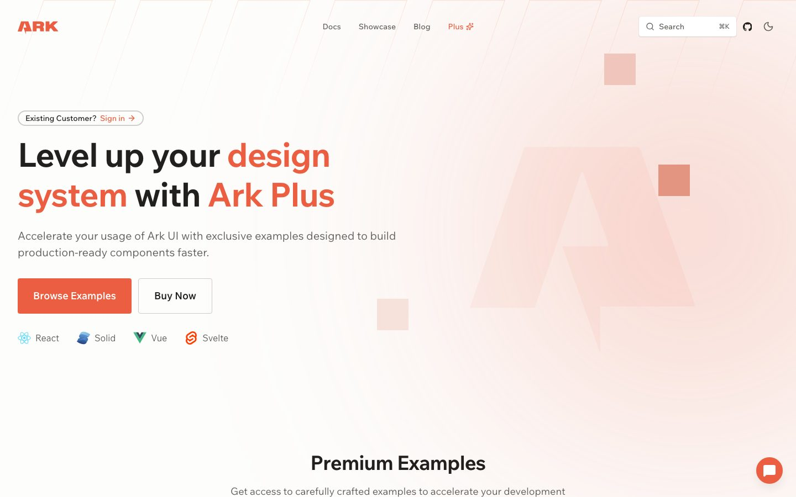

#### daisyUI
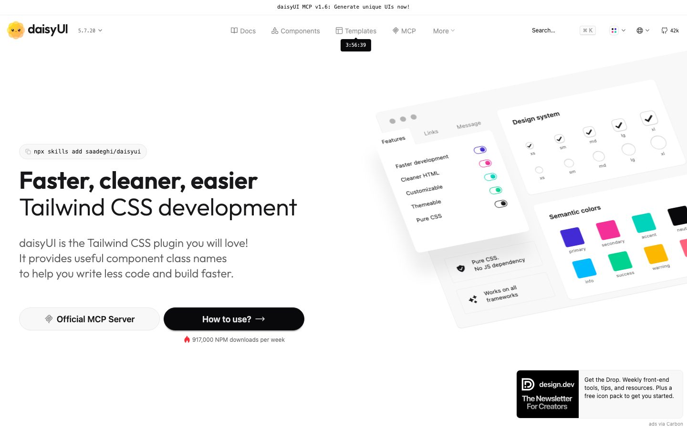

`daisyui.com` — A **pure CSS Tailwind plugin**, not a JS library: framework-agnostic, works with plain HTML
or anything. ~60+ components, 32 themes. By Pouya Saadeghi. 42,156 stars.
- **Free:** The entire core plugin, unlimited commercial use, **MIT**.
- **Paid:** Optional store templates — Auth **$19**; HTML dashboard/blog/docs/landing ~**$29** each; Charts and Figma library **$39–49**; Nexus/Scalo dashboards from **$69**.
- **Subscription needed?** Never for components — only if you want ready-made pages or the Figma library.
- **API:** npm `daisyui` (v5.7.20, 20 Aug 2026), installed as a Tailwind plugin. No CLI/MCP.
- **Best for:** Non-React projects wanting Tailwind-native styled components with **zero JS dependency**.
- **Watch-out:** ⚠️ Pure CSS means **no interaction behaviour** — no focus trapping, no keyboard nav. Pair it with Headless UI or Ark UI for complex components. Requires Tailwind.

---

### Guidelines & Accessibility

#### Apple Human Interface Guidelines
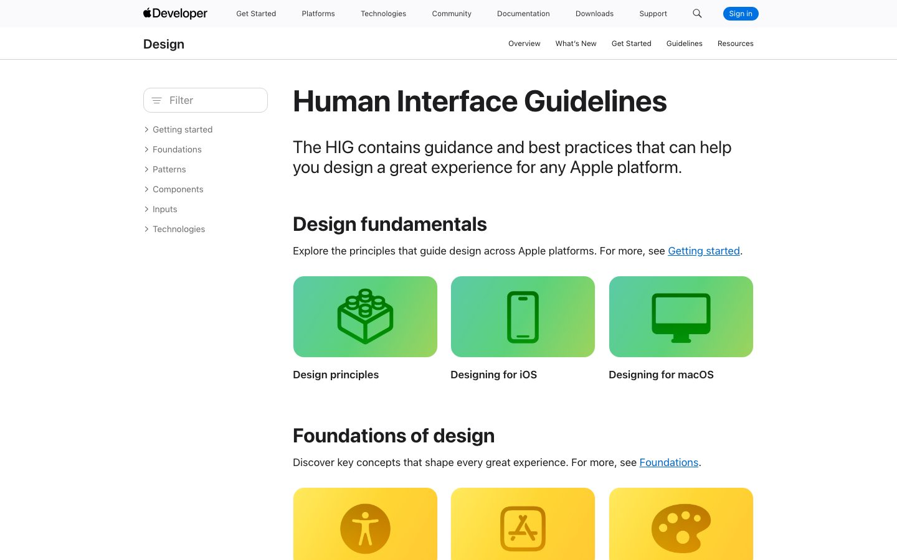

`developer.apple.com/design/human-interface-guidelines` — Apple's official guidelines for iOS, macOS,
watchOS, tvOS and visionOS: interaction patterns, layout, accessibility and platform conventions.
- **Free:** All guideline content, plus **free Figma and Sketch UI kits** for every platform. No signup.
- **Paid:** Free — no paid tier. · **Subscription needed?** Not needed.
- **License:** ⚠️ **Apple Design Resources License** — a limited, non-transferable, non-exclusive licence **for developing applications**. The HIG text and images are © Apple with an explicit prohibition on reproducing, storing or transmitting any part **without prior written permission**. You may design against it; you may **not** reproduce it or redistribute the kits.
- **API:** None. Kits download from `/design/resources/`.
- **Best for:** Anything native on an Apple platform.
- **Watch-out:** The reproduction restriction is unusually strict — don't paste HIG content into a commercial deck.

#### Material Design 3
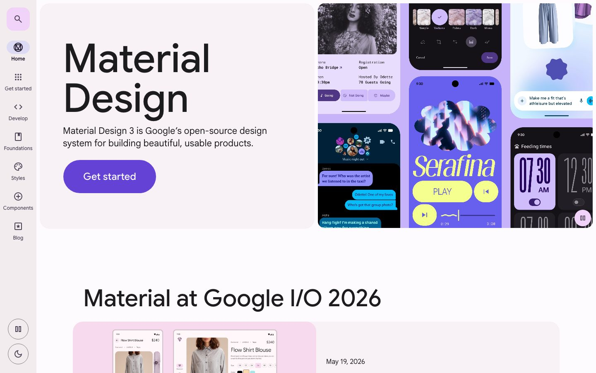
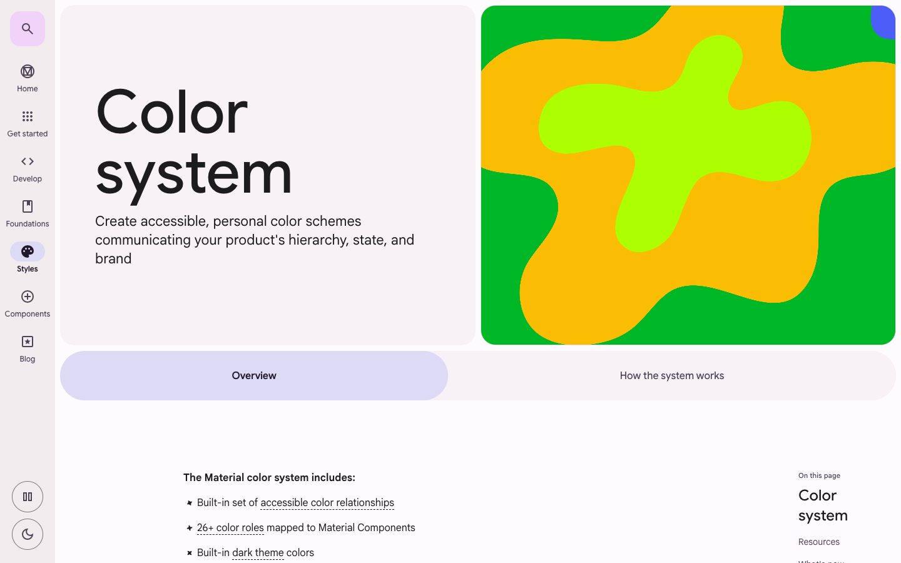

`m3.material.io` — Google's open-source design system: guidelines, components and **design tokens** for
Android, iOS, Flutter and web.
- **Free:** All guidelines, tokens and component docs; the official M3 Figma kit is free in Figma Community. No signup.
- **Paid:** Free — no paid tier. · **Subscription needed?** Not needed.
- **License:** Component implementations are **Apache-2.0** (Android/iOS), **MIT** (web) and **BSD-3-Clause** (Flutter). Guideline *content* is © Google, and the **Figma kit is under the Figma Community Free Resource License** — proprietary, non-exclusive, **non-sublicensable**. Shipping components commercially is fine; reselling the kit is not.
- **API:** No public API. Components via npm/Maven per platform; kit imports from Figma Community.
- **Best for:** Consistent components across Android, iOS, web and Flutter at once.
- **Watch-out:** The Figma Community licence is more restrictive than it looks — no sublicensing, no redistributable derivatives.

#### Laws of UX
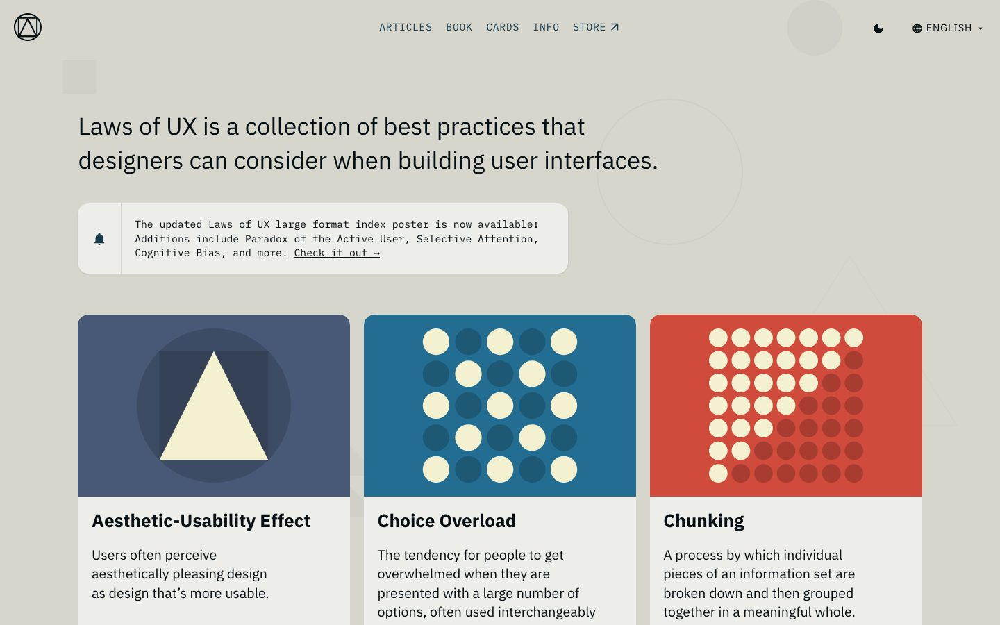

`lawsofux.com` — 30+ cognitive-psychology and behavioural principles for interface design, each with
explanation, references and applications. By Jon Yablonski.
- **Free:** All 30+ principles, plus free 11×17″ printable posters. No signup.
- **Paid:** High-resolution 18×24″ posters from the creator's store; price `unverified`.
- **Subscription needed?** Not needed for the content.
- **License:** 🔴 **CC BY-NC-ND 4.0** — attribution required, **commercial use prohibited**, no derivatives. The free posters carry the same terms.
- **API:** None.
- **Best for:** The psychology behind UX heuristics.
- **Watch-out:** 🔴 **This cannot go into a client deck, a paid course, or a commercial product** without the creator's explicit permission. The most commonly breached licence in this catalogue.

#### WebAIM Contrast Checker
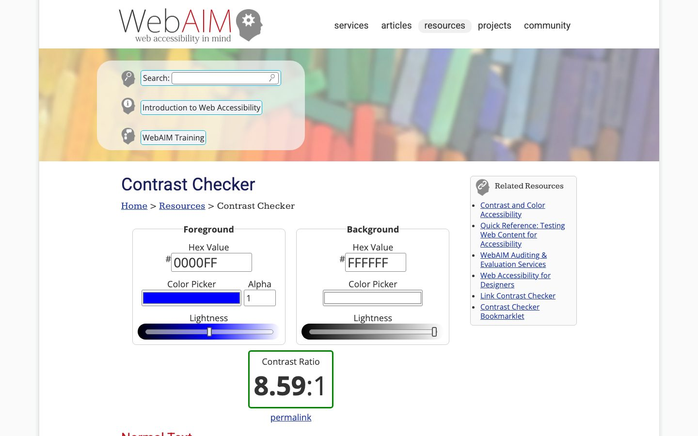

`webaim.org/resources/contrastchecker/` — Free tool for testing foreground/background contrast against
WCAG AA and AAA, by hex input or picker.
- **Free:** Fully functional, no signup, plus a bookmarklet for testing live pages.
- **Paid:** Free — no paid tier. · **Subscription needed?** Not needed.
- **License:** © WebAIM, all rights reserved — **but** content may be reproduced and distributed at no cost **if full credit is given** with a link to webaim.org and the copyright notice stays intact. You may **not** sell, barter or monetise reproduced material.
- **API:** ✅ **Yes** — append `&api` to the tool's permalink (e.g. `?fground=000000&bground=ffffff&api`) for JSON with the ratio and AA/AAA pass/fail. A genuinely useful, undocumented-feeling endpoint.
- **Best for:** Quick WCAG compliance checks, scriptable.
- **Watch-out:** Output cannot be commercialised or resold.

#### The A11y Project
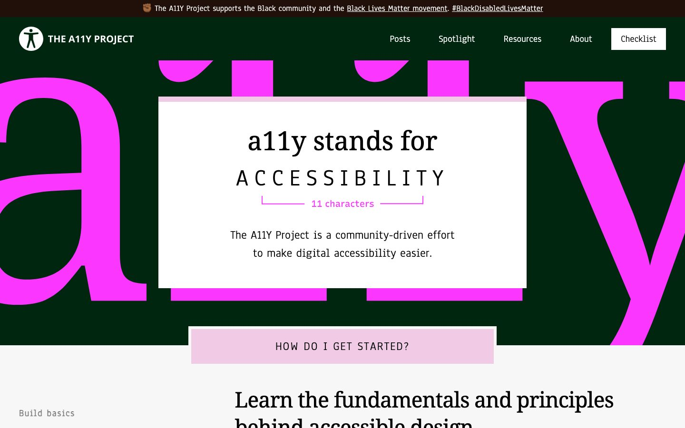

`a11yproject.com` — Community-driven accessibility resource: guides, a resource library, a **WCAG 2
checklist**, educational posts and open-source tooling.
- **Free:** Everything, no signup. · **Paid:** Free — no paid tier. · **Subscription needed?** Not needed.
- **License:** **Apache-2.0** — free use, modification and redistribution, **commercial included**, with attribution and patent protection.
- **API:** No public API. Source at `github.com/a11yproject/a11yproject.com`.
- **Best for:** Accessibility learning and audit checklists.
- **Watch-out:** None. Notably, this is the one guidelines resource with a genuinely commercial-friendly licence.

---

### Tools & Resources

#### Toolfolio
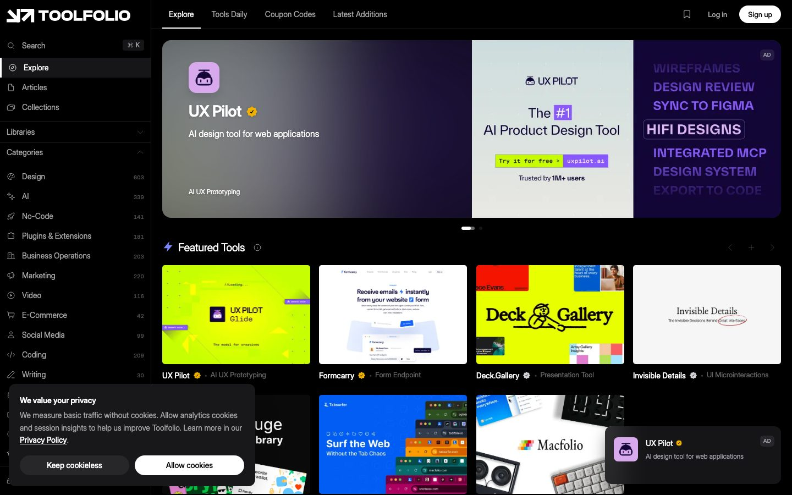

`toolfolio.io` **301 → `toolfolio.com`** — Discovery platform cataloguing 20+ categories of software tools
(design, AI, no-code, marketing, video) with comparison collections, articles and a Discord.
- **Free:** Browse everything without login; free basic tool listing for vendors.
- **Paid:** **Vendor-side only** — Startup **$150 one-time** (silver badge, do-follow link, basic analytics); Growth **$250/mo** (or $208/mo annual — gold badge, full enrichment, lead gen, priority ranking, homepage placement). Add-ons: Featured Positions **$400/mo**, Banner **$500 per 50K impressions**.
- **Subscription needed?** **No** — the paid tiers are for listing your own product.
- **License / API:** `unverified` / none documented.
- **Best for:** Discovering emerging tools; or buying visibility if you make one.
- **Watch-out:** 🟡 **Repoint to `.com`**. Also a vendor marketing directory rather than a design-asset source — consider whether it earns its slot.

#### GetDesign
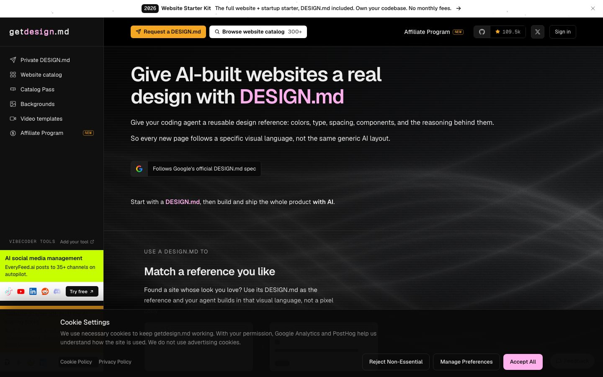

`getdesign.md` — 300+ curated **`DESIGN.md` files** (machine-readable design-system descriptions) extracted
from major brands — Apple, Figma, Stripe, Shopify, Nike, Tesla — so AI coding agents generate
brand-consistent UI.
- **Free:** Browse the full public catalogue of 300+ files and their analyses. No signup.
- **Paid:** **Private DESIGN.md $39 one-time** (custom analysis of any site); **Website Starter Kit + DESIGN.md $249 one-time** (full-stack template with auth, payments, email, analytics).
- **Subscription needed?** One-time only, and only for a site not already catalogued.
- **License:** Proprietary. Public files stated free for commercial use **without attribution**; redistribution or resale as a standalone product is prohibited.
- **API:** None; web interface only.
- **Best for:** Giving an agent brand-consistent design decisions up front.
- **Watch-out:** ⚠️ These are **third-party analyses of publicly visible patterns** — not official, not endorsed by the brands named.

#### Taste Skill
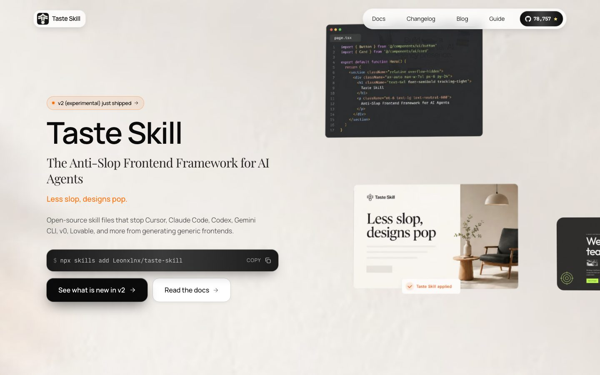

`tasteskill.dev` — Open-source **"anti-slop" frontend design framework** as `SKILL.md` files for AI agents
(Cursor, Claude Code, v0, Codex, Gemini, OpenCode, Lovable): 13+ skills of design rules, typography
guidance, spacing protocols and visual-direction constraints to stop generic template output.
- **Free:** Completely — `npx skills add Leonxlnx/taste-skill`.
- **Paid:** Free. Optional GitHub Sponsors. · **Subscription needed?** Not needed.
- **License:** **MIT**, full commercial use.
- **API:** Repo `Leonxlnx/taste-skill`, installed via npx rather than a published npm package.
- **Best for:** Enforcing design judgment in agent-written UI.
- **Watch-out:** ⚠️ The v2 line is **explicitly experimental** (breaking changes expected before 2.0.0), adds **~20–22k tokens of context overhead per session**, and is locked to React/Next + Tailwind v4. `design-taste-frontend-v1` is the stable fallback.

#### UI Goodies
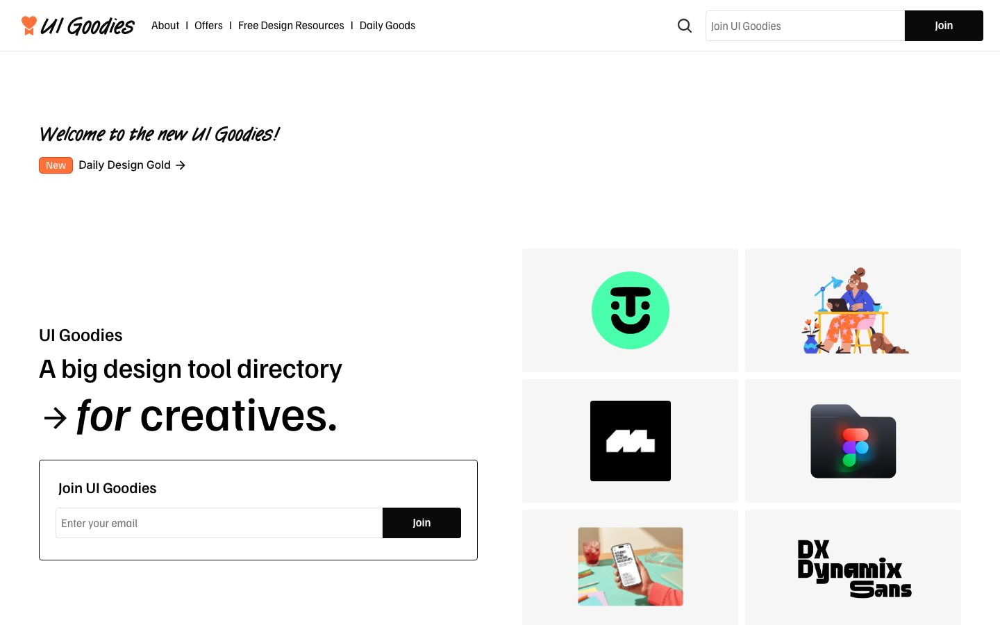

`uigoodies.com` — Curated directory of 300,000+ hand-picked design resources by category: icons,
illustrations, color tools, typography, mockups, UI kits and AI design tools. Active as of July 2026.
- **Free:** Full browsing, all categories, no signup.
- **Paid:** Free — no paid tier of its own (it carries affiliate promotions).
- **Subscription needed?** Not needed.
- **License:** The 300,000+ vectors/icons are confirmed free for commercial use; **attribution requirements `unverified`** — the licence page 404s.
- **API:** `unverified` — none documented.
- **Best for:** Browsing curated design tools and assets by category.
- **Watch-out:** Confirm attribution with each individual linked resource, not with UI Goodies.

#### Sidebar
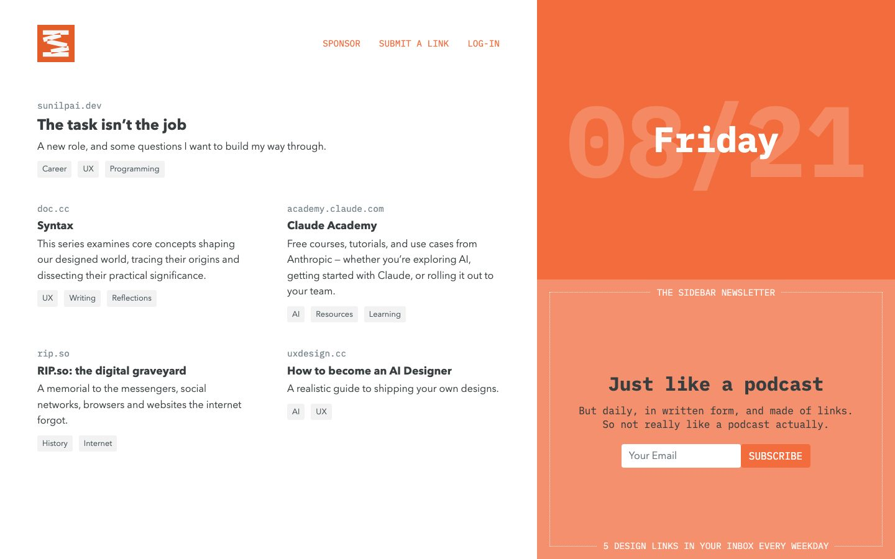

`sidebar.io` — Five best design links every weekday, by newsletter and web archive, across UX, AI, design
systems, typography and accessibility.
- **Free:** Browse everything and subscribe free; signup not required to read; submissions open.
- **Paid:** Free — monetised by sponsored placements (~$950 per slot).
- **Subscription needed?** Not needed.
- **License:** 🔴 **Non-commercial only** — the terms grant "personal, non-commercial transitory viewing only" and prohibit use "for any commercial purpose, or for any public display".
- **API:** No first-party API; an RSS feed exists.
- **Best for:** Daily discovery of editorial-quality design writing.
- **Watch-out:** 🔴 That non-commercial clause is stricter than most people assume for a links site.

#### Superset
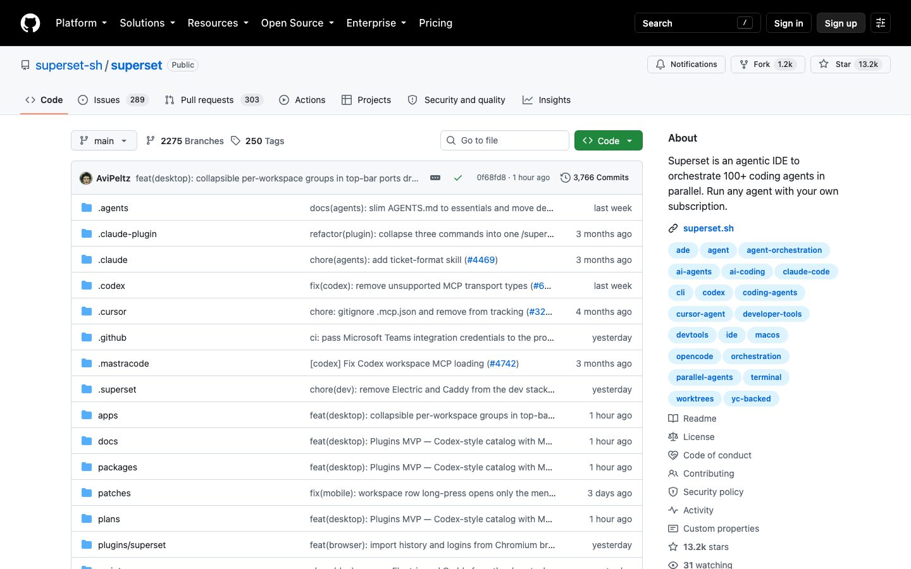

`github.com/superset-sh/superset` — Agentic IDE / desktop app for orchestrating **100+ coding agents in
parallel** (Claude Code, Cursor Agent) in isolated git worktrees, with a shared terminal, diff viewer and
browser preview. By Superset Labs.
- **Free:** Fully source-available and self-hostable; the desktop app is described as "free forever".
- **Paid:** Free — no paid tier. · **Subscription needed?** Not needed.
- **License:** ⚠️ **Elastic License 2.0** — source-available, **not OSI-approved open source**. Using, forking, modifying and self-hosting for your team is permitted; **commercial redistribution or hosting-as-a-service is restricted.**
- **API:** Desktop app, not an npm package. TypeScript, **~13.1k stars**, last commit **20 Aug 2026** with daily releases — actively maintained.
- **Best for:** Running and reviewing many AI coding agents from one control surface.
- **Watch-out:** Check ELv2 before relying on it in a proprietary or SaaS context.

---

## 5. Method & caveats

**Research.** Five agents ran in parallel over the 80 catalogue entries, instructed to read each site's own
`/pricing`, `/license` and `/terms` and to write **`unverified`** rather than guess. Every price in this
document is either primary-sourced or explicitly flagged.

**Screenshots.** Playwright + Chromium, 1440×900 viewport, light color scheme, `en-US`, JPEG q82, captured
21 August 2026. Each page settles for 2.5s, scrolls to trigger lazy loading, returns to top, then captures.
Eleven initially blocked or 404'd; a retry pass with a full Chromium build and a 9s challenge-resolution
wait recovered Behance (403), SVG Repo (429), Unsplash (bot challenge), Motion.page, Land-book Pro,
Transitions and Unsplash+. **Brandfetch remained behind Cloudflare and Pixcap does not resolve** — both are
documented in place rather than filled with a placeholder.

**Known gaps — deliberately not guessed:**
- Pricing `unverified`: Mobbin, HeroUI Pro, Rotato, Shots, Blush, Storyset premium, Whirrls, Unsplash+, UI Sources/ScreensDesign, Behance Pro, Awwwards submission.
- Licence `unverified`: Color Hunt, Happy Hues, Whirrls, World in Dots, Womp, Shots, Rotato, Mobbin, Page Flows, Styles Refero, Design Systems Repo, Startups Gallery, Toolfolio, UI Goodies attribution.
- Sites that render only under a real browser session resist automated verification by design; those are
  marked rather than approximated.

**Re-running this.** The capture script and site manifest are reproducible — re-shoot with the same
viewport and quality settings to keep `shots/` visually consistent across updates.

---

*Generated 21 August 2026 for [`nexu-io/open-design`](https://github.com/nexu-io/open-design). Prices and
licences change without notice — treat this as a verified snapshot, not a standing guarantee.*
